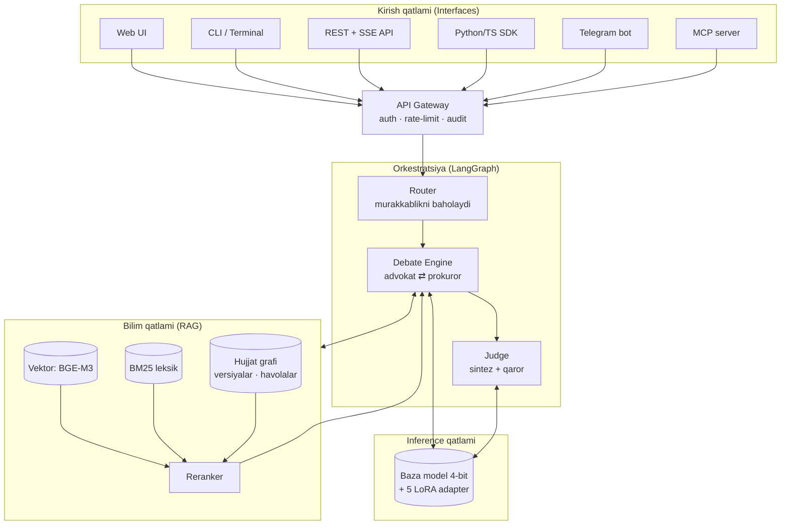

# UzLegal-AI

> O'zbekiston huquqiy tizimi uchun ko'p-agentli, iqtibosga asoslangan (citation-grounded) sun'iy intellekt platformasi.

[]()
[]()
[]()

---

## Loyiha nima?

UzLegal-AI — bu bitta chatbot emas. Bu **beshta yuridik rolni** o'ynay oladigan va bir masalani **turli nuqtai nazardan** hal qilib, so'ng ularni muvozanatga soladigan huquqiy mulohaza yuritish tizimi:

| Agent | Roli | Nima beradi |
|-------|------|-------------|
| **Yurist** (`jurist`) | Faktlarni ajratadi, tegishli normalarni topadi | Neytral huquqiy tahlil |
| **Advokat** (`advocate`) | Mijoz foydasiga eng kuchli pozitsiya | Himoya argumentlari, protsessual imkoniyatlar |
| **Prokuror** (`prosecutor`) | Qarama-qarshi pozitsiya, ayblov | Zaif nuqtalar, qarshi dalillar |
| **Professor** (`professor`) | Doktrina, kolliziyalar, qiyosiy huquq | Nazariy asos, ilmiy sharh |
| **Sudya** (`judge`) | Dalillarni tortadi, yakun chiqaradi | Asoslangan, muvozanatli xulosa |

Bu **adversarial (qarama-qarshilikka asoslangan)** dizayn tasodifiy emas — u real sud jarayonining strukturasini takrorlaydi va bitta modelning bir tomonlama javob berish tendensiyasini kamaytiradi.

## Asosiy tamoyil: iqtibossiz javob yo'q

Yuridik AI dagi eng katta xavf — modelning **mavjud bo'lmagan qonun moddasini o'ylab topishi** (hallucination). Bu tizimda:

- Har bir huquqiy da'vo real hujjatga havola bilan qaytariladi: `[FK, 234-modda, 2024-yil tahriri]`
- Havola bilan tasdiqlanmagan da'vo javobdan **avtomatik chiqariladi** (`groundedness gate`)
- Bekor qilingan yoki o'zgartirilgan norma `deprecated` deb belgilanadi va ishlatilmaydi
- Model bilmasa — **"bilmayman"** deydi. Rad etish darajasi (`refusal rate`) o'lchanadigan metrika

> **Ogohlantirish:** Bu tizim yuridik maslahat bermaydi. U yuridik **tadqiqot vositasi**. Har qanday xulosa malakali yurist tomonidan tasdiqlanishi shart.

---

## Arxitektura (qisqacha)



To'liq tavsif: [`docs/01-architecture.md`](docs/01-architecture.md)

---

## Ishlash rejimlari

Tizim bitta yadro (`core`) ustiga qurilgan va **oltita** turli usulda ishlatiladi:

| Rejim | Buyruq / manzil | Foydalanuvchi |
|-------|-----------------|---------------|
| Terminal (interaktiv) | `uzlegal chat --agent judge` | Yurist, dasturchi |
| Terminal (bir martalik) | `uzlegal ask "..." --json` | Skript, CI |
| Web UI | `http://localhost:3000` | Yakuniy foydalanuvchi |
| REST + streaming | `POST /v1/consult` (SSE) | Integratsiya |
| SDK | `pip install uzlegal` | Dasturchi |
| MCP server | `uzlegal mcp serve` | Claude Code, IDE |

Batafsil: [`docs/07-interfaces.md`](docs/07-interfaces.md)

### Joylashtirish variantlari

| Profil | Apparat | Model | Holat |
|--------|---------|-------|-------|
| `local-dev` | MacBook Air M4 24 GB | 14B 4-bit | Butunlay oflayn, internetsiz |
| `workstation` | Mac Studio / RTX 4090 | 14B 8-bit yoki 32B 4-bit | Jamoa ishi |
| `server` | Linux + A100/H100 | 32B+ , vLLM | Ishlab chiqarish |
| `hybrid` | Local + bulut fallback | Yengil savol local, og'iri bulutga | Tejamkor |
| `air-gapped` | Izolyatsiya qilingan tarmoq | To'liq oflayn | Davlat/maxfiy ma'lumot |

Batafsil: [`docs/09-deployment.md`](docs/09-deployment.md)

---

## Hujjatlar

| # | Hujjat | Mavzu |
|---|--------|-------|
| 00 | [Umumiy ko'rinish](docs/00-overview.md) | Muammo, maqsad, doira, muvaffaqiyat mezonlari |
| 01 | [Arxitektura](docs/01-architecture.md) | Tizim dizayni, qatlamlar, ma'lumot oqimi |
| 02 | [Apparat va runtime](docs/02-hardware-runtime.md) | M4 24 GB byudjeti, MLX, kvantlash |
| 03 | [Ma'lumot quvuri](docs/03-data-pipeline.md) | Yig'ish, tozalash, versiyalash, chunking |
| 04 | [RAG tizimi](docs/04-rag.md) | Gibrid qidiruv, reranking, groundedness |
| 05 | [Fine-tuning](docs/05-finetuning.md) | LoRA, dataset, trening, baholash |
| 06 | [Agentlar](docs/06-agents.md) | Rollar, debate protokoli, orkestratsiya |
| 07 | [Interfeyslar](docs/07-interfaces.md) | CLI, Web, API, SDK, MCP, bot |
| 08 | [Baholash](docs/08-evaluation.md) | Metrikalar, gold set, regressiya testlari |
| 09 | [Joylashtirish](docs/09-deployment.md) | Profillar, Docker, monitoring |
| 10 | [Xavfsizlik va muvofiqlik](docs/10-security-compliance.md) | PII, audit, huquqiy javobgarlik |
| 11 | [Yo'l xaritasi](docs/11-roadmap.md) | Fazalar, muddatlar, risklar |
| 12 | [Repo strukturasi](docs/12-repo-structure.md) | Kod tashkiloti, modullar |

**Arxitektura qarorlari (ADR):** [`docs/adr/`](docs/adr/) — nima uchun aynan shu texnologiya tanlangani va qanday muqobillar rad etilgani.

---

## Tezkor boshlash (rejalashtirilgan)

```bash
git clone https://github.com/ShokirjonMK/uzlegal-ai.git
cd uzlegal-ai

# 1. Muhit (Apple Silicon)
make setup-mac

# 2. Baza modelni yuklash va nomzodlarni solishtirish
uzlegal models bench --candidates qwen3-14b,gemma3-12b

# 3. Bilim bazasini qurish
uzlegal ingest --source lex.uz --since 2020-01-01
uzlegal index build

# 4. Ishga tushirish
uzlegal serve --profile local-dev
```

---

## Loyiha holati

**Hozirgi bosqich: Faza 0 — dizayn va muhit.** Bu repozitoriyda ayni paytda to'liq arxitektura hujjatlari va texnik spetsifikatsiya mavjud. Implementatsiya yo'l xaritasi bo'yicha bosqichma-bosqich qo'shiladi — [`docs/11-roadmap.md`](docs/11-roadmap.md).

Har bir modul o'z spetsifikatsiyasiga ega, shuning uchun ular **parallel** ishlab chiqilishi mumkin.

---

## Litsenziya

MIT — [`LICENSE`](LICENSE)

Manba huquqiy hujjatlar (lex.uz va boshqalar) O'zbekiston Respublikasi qonunchiligiga muvofiq ochiq ma'lumot hisoblanadi va o'z shartlari asosida ishlatiladi.

## Muallif

**Shokirjon Madaminov** — [@ShokirjonMK](https://github.com/ShokirjonMK)
