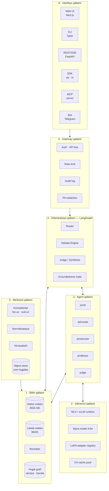
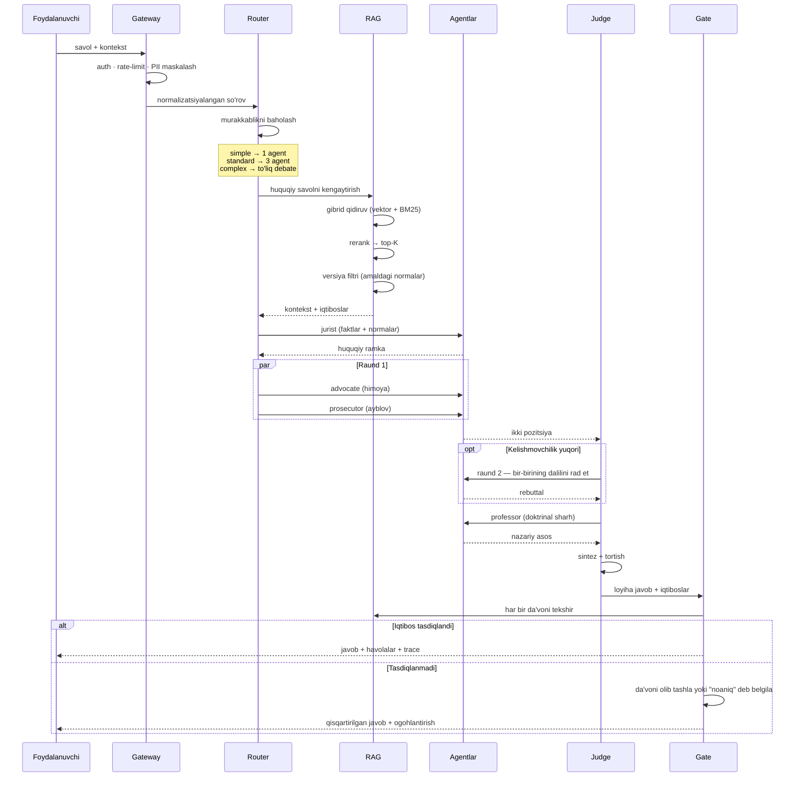
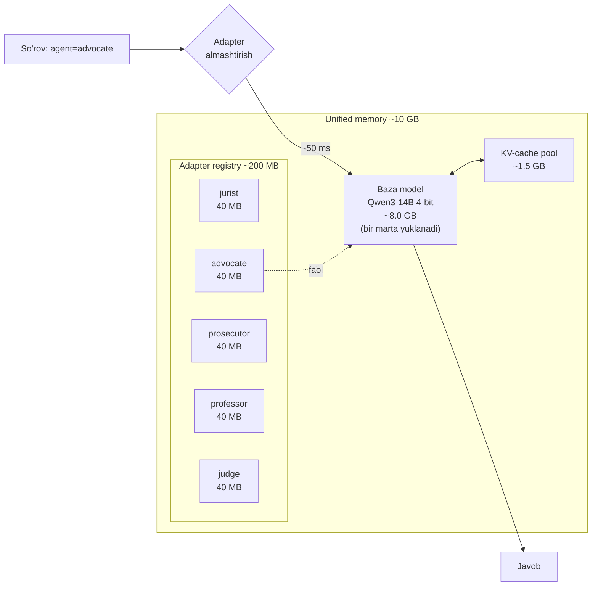
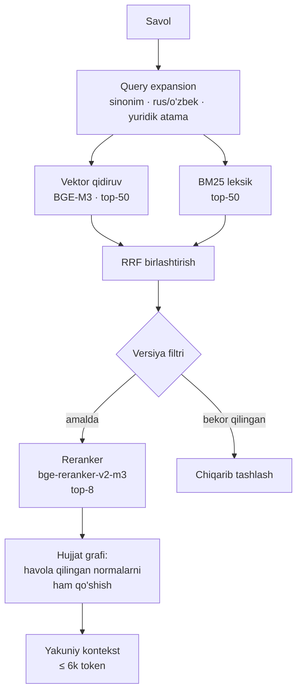
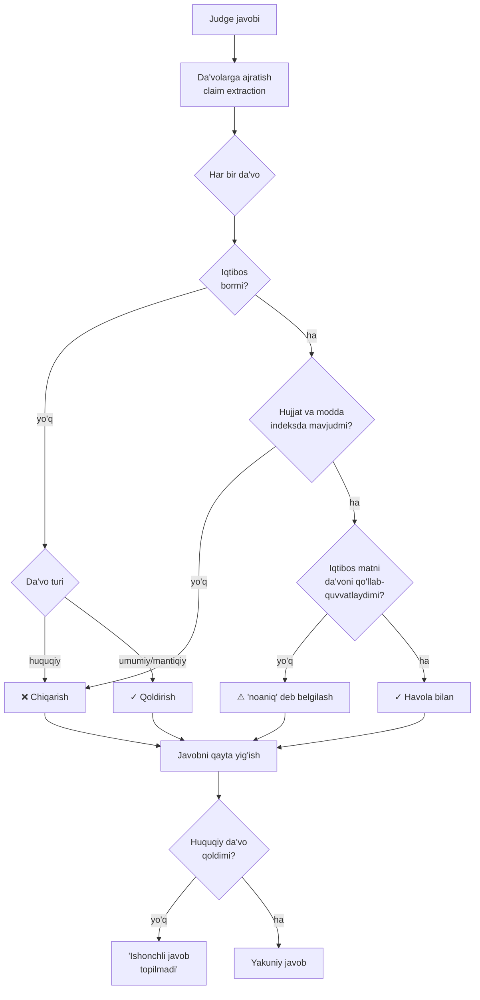
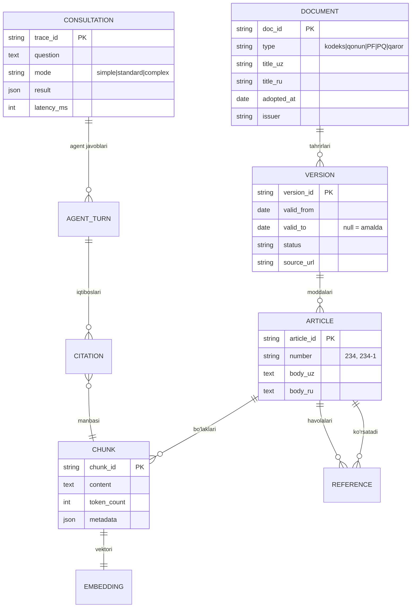

# 01 — Arxitektura

## 1. Dizayn tamoyillari

Barcha keyingi qarorlar shu beshta tamoyildan kelib chiqadi:

**T1 — Bilim modelda emas, indeksda.** Model qonunni "yodlamaydi". Model *mulohaza yuritishni* biladi, faktni indeksdan oladi. Qonun o'zgarsa — indeks yangilanadi, model qayta o'qitilmaydi.

**T2 — Iqtibos majburiy.** Har bir huquqiy da'vo `document_id + article + version` uchligiga bog'lanadi. Bog'lanmagan da'vo javobdan chiqariladi.

**T3 — Bitta baza, ko'p adapter.** Beshta rol beshta model emas. Bitta kvantlangan baza + beshta LoRA adapter. Bu 24 GB cheklovini hal qiladi va rollarni izchil saqlaydi.

**T4 — Yadro interfeysdan mustaqil.** `core` kutubxonasi HTTP, terminal yoki bot haqida hech narsa bilmaydi. Har bir interfeys — yupqa adapter.

**T5 — Har bir qadam kuzatiladi.** Retrieval natijasi, har agentning javobi, sudyaning qarori — hammasi trace ga yoziladi. Yuridik tizimda "model shunday dedi" yetarli emas; nima uchun deganini ko'rsatish kerak.

---

## 2. Qatlamli ko'rinish



Har bir qatlam faqat o'zidan pastdagisiga bog'liq. Bu modullarni **parallel ishlab chiqish** imkonini beradi — RAG jamoasi agent qatlami tayyor bo'lishini kutmaydi.

---

## 3. So'rov hayotiy sikli

Foydalanuvchi savol beradi. Nima sodir bo'ladi:



### Router mantiqi

Har bir savolga to'liq debate kerak emas — u qimmat (45 s, ~8k token). Router uch darajaga ajratadi:

| Daraja | Belgilari | Oqim | Kechikish |
|--------|-----------|------|-----------|
| `simple` | Faktik: "MMTning hozirgi stavkasi?" | RAG → `jurist` → gate | ~5 s |
| `standard` | Bir tomonlama tahlil: "Bu shartnoma haqiqiymi?" | RAG → `jurist` → `professor` → `judge` | ~20 s |
| `complex` | Nizoli: "Bu ishda kim haq?" | To'liq debate | ~45 s |

Router — kichik klassifikator (baza model + qisqa prompt, yoki o'qitilgan yengil model). Foydalanuvchi `--mode` bilan majburlashi mumkin.

---

## 4. Inference qatlami: bitta baza, ko'p adapter

Bu loyihaning markaziy texnik qarori.

### Muammo

Beshta 14B modelni 4-bit da yuklash = ~40 GB. Mashinada 24 GB (undan ~18 GB GPU uchun). Sig'maydi.

### Yechim



**Nima uchun ishlaydi:** LoRA adapteri — bu asosiy vazn matritsalariga qo'shiladigan kichik past-rangli qo'shimcha (`W' = W + BA`). Adapterni almashtirish = 40 MB ni ko'chirish, 8 GB ni emas. MLX da bu ~50 ms.

**Qo'shimcha foyda:** barcha rollar bir xil huquqiy bilimni bo'lishadi (baza da o'qitilgan), faqat *uslub va pozitsiya* farq qiladi. Bu izchillikni ta'minlaydi — advokat va prokuror bir xil qonunni turlicha *talqin* qiladi, turlicha *bilmaydi*.

Batafsil: [ADR-003](adr/ADR-003-single-base-multi-adapter.md), [`docs/02-hardware-runtime.md`](02-hardware-runtime.md)

---

## 5. Bilim qatlami: uch komponentli retrieval

Bitta vektor qidiruv yuridik matn uchun yetarli emas. Sabab: yuristlar **aniq raqam va atama** bilan qidiradi ("234-modda", "vindikatsiya da'vosi"), semantik qidiruv esa aniq mosliklarni ba'zan o'tkazib yuboradi.



**Versiya filtri** — yuridik RAG ni oddiy RAG dan ajratadigan narsa. Har bir chunk metadatasida:

```json
{
  "doc_id": "uz-fk-1996",
  "article": "234",
  "version": "2024-03-15",
  "valid_from": "2024-04-01",
  "valid_to": null,
  "status": "in_force",
  "supersedes": "2019-11-20",
  "amended_by": ["uz-zru-812-2023"]
}
```

Filtr `valid_to != null` bo'lgan chunklarni chiqaradi (agar foydalanuvchi aniq tarixiy sanani so'ramagan bo'lsa — "2021-yilda qanday edi?" degan savol uchun `as_of` parametri bor).

Batafsil: [`docs/04-rag.md`](04-rag.md)

---

## 6. Groundedness Gate

Javob foydalanuvchiga yetib borishidan oldingi oxirgi to'siq. Bu **model emas — deterministik tekshiruv**.



Uchinchi qadam ("iqtibos matni da'voni qo'llab-quvvatlaydimi?") — NLI modeli yoki baza modelning qisqa tekshirish chaqiruvi. Bu eng qimmat qadam, shuning uchun faqat huquqiy da'volarga qo'llaniladi.

**Muhim:** gate javobni *yaxshilamaydi* — u faqat **olib tashlaydi**. Bu ataylab. Gate hech qachon yangi matn generatsiya qilmaydi, aks holda u o'zi hallucination manbaiga aylanadi.

---

## 7. Ma'lumot modeli (asosiy entitilar)



---

## 8. Modullar va mas'uliyat chegaralari

| Modul | Paket | Mas'uliyat | Bog'liqligi |
|-------|-------|------------|-------------|
| **Ingest** | `uzlegal.ingest` | Manbalardan yig'ish, normalizatsiya, versiyalash | — |
| **Index** | `uzlegal.index` | Chunking, embedding, BM25, graf qurish | `ingest` |
| **Retrieval** | `uzlegal.retrieval` | Gibrid qidiruv, rerank, versiya filtri | `index` |
| **Inference** | `uzlegal.inference` | Model yuklash, adapter almashtirish, generatsiya | — |
| **Agents** | `uzlegal.agents` | Rol promptlari, debate protokoli | `inference`, `retrieval` |
| **Orchestrator** | `uzlegal.orchestrator` | LangGraph grafi, router, judge, gate | `agents` |
| **Training** | `uzlegal.training` | Dataset qurish, LoRA trening, merge | `inference` |
| **Eval** | `uzlegal.eval` | Metrikalar, gold set, regressiya | hammasi |
| **API** | `uzlegal.api` | FastAPI, SSE, auth | `orchestrator` |
| **CLI** | `uzlegal.cli` | Terminal interfeysi | `orchestrator` |
| **MCP** | `uzlegal.mcp` | MCP server | `orchestrator` |

Qat'iy qoida: **`core` (ingest→orchestrator) hech qachon interfeys paketlarini import qilmaydi.** Bog'liqlik faqat bir yo'nalishda.

Kod strukturasi: [`docs/12-repo-structure.md`](12-repo-structure.md)

---

## 9. Kengaytirish nuqtalari

Tizim quyidagi joylarda kengaytiriladigan qilib loyihalangan:

| Nuqta | Interfeys | Misol foydalanish |
|-------|-----------|-------------------|
| Yangi manba | `SourceConnector` | Vazirlik sayti, xalqaro shartnomalar |
| Yangi agent roli | `AgentRole` + adapter | Notarius, soliq inspektori, mediator |
| Yangi retriever | `Retriever` | Graf-asosli qidiruv, SQL |
| Yangi interfeys | `core` ni chaqiradi | WhatsApp bot, VS Code kengaytmasi |
| Yangi runtime | `InferenceBackend` | vLLM, llama.cpp, bulut API |
| Yangi til | Til paketi | Qoraqalpoq, ingliz |

Yangi agent qo'shish uchun kod o'zgartirish shart emas — YAML konfiguratsiya + o'qitilgan adapter yetarli:

```yaml
# configs/agents/notary.yaml
role: notary
adapter: adapters/notary-v1
temperature: 0.2
system_prompt_file: prompts/notary.uz.md
retrieval_profile: notarial_acts
participates_in_debate: false
```

---

## 10. Nima *ataylab* qilinmagan

Senior dizaynda rad etilgan variantlarni yozib qo'yish muhim:

| Variant | Nima uchun rad etildi |
|---------|----------------------|
| Har rol uchun alohida to'liq model | 40 GB RAM kerak; rollar o'rtasida bilim nomuvofiqligi |
| Faqat fine-tuning, RAG siz | Qonun o'zgarganda qayta o'qitish kerak; iqtibos berib bo'lmaydi |
| Faqat RAG, fine-tuning siz | Rol uslublari zaif; o'zbek yuridik tili g'aliz |
| Agentlar erkin muloqoti (autonomous chat) | Konvergensiya kafolatlanmaydi, xarajat oldindan bilinmaydi |
| Bulut LLM (GPT/Claude) API asosida | Maxfiy ish ma'lumoti tashqariga chiqadi; oflayn ishlamaydi; qimmat |
| Javobni gate da qayta yozish | Gate ning o'zi hallucination manbaiga aylanadi |

---

## 11. Keyingi hujjat

→ [02 — Apparat va runtime](02-hardware-runtime.md)
