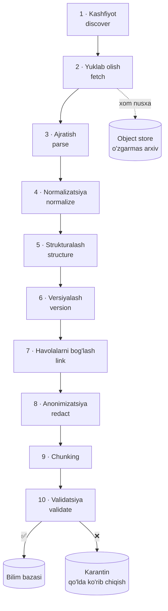
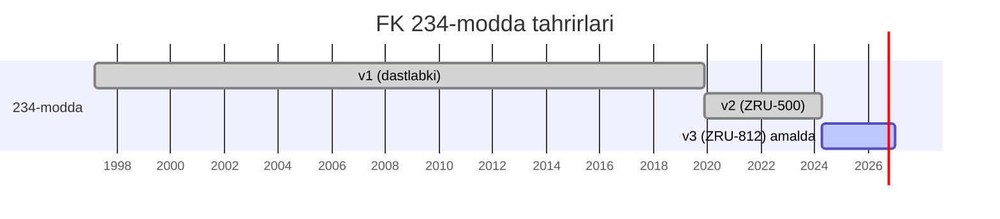
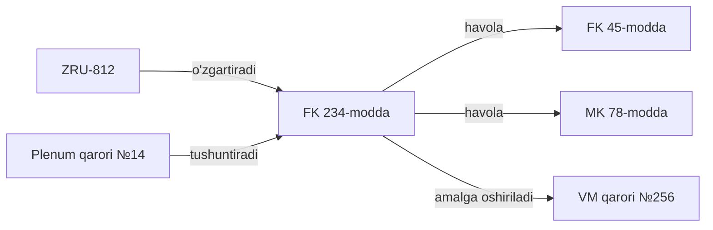

# 03 — Ma'lumot quvuri

> Bu loyihaning eng og'ir va eng muhim bosqichi. Model sifati bu yerda hal bo'ladi, fine-tuningda emas.

## 1. Nima uchun bu eng muhim modul

Yuridik AI da xatolar ierarxiyasi:

```
Noto'g'ri parsing  →  noto'g'ri chunk  →  noto'g'ri retrieval  →  noto'g'ri javob
      (0-qatlam)                                                    (foydalanuvchi ko'radi)
```

0-qatlamdagi xato yuqoridagi hech qanday texnologiya bilan tuzatilmaydi. Agar 234-modda matni 233-modda deb belgilangan bo'lsa, dunyodagi eng yaxshi model ham to'g'ri javob bera olmaydi.

Shuning uchun: **quvurning har bir bosqichi validatsiyalanadi va namunaviy qo'lda tekshiriladi.**

## 2. Manbalar

| Manba | Turi | Hajm (taxminiy) | Ustuvorlik | Kirish usuli |
|-------|------|-----------------|------------|--------------|
| `lex.uz` | Qonunchilik MB — kodekslar, qonunlar, PF, PQ | ~40k hujjat | **P0** | HTML + ochiq API (bo'lsa) |
| `public.sud.uz` | Sud qarorlari (ochiq) | ~500k qaror | P1 | HTML |
| Oliy sud Plenumi | Tushuntirish qarorlari | ~300 hujjat | **P0** | PDF/HTML |
| Vazirliklar saytlari | Idoraviy hujjatlar | ~10k | P2 | HTML/PDF |
| Yuridik darsliklar | Doktrina | ~50 kitob | P2 | PDF (huquqi bo'lsa) |
| Ilmiy maqolalar | Doktrina | ~2k | P3 | PDF |

### Huquqiy va etik jihatlar

- Normativ-huquqiy hujjatlar O'zbekiston qonunchiligi bo'yicha **ochiq ma'lumot** — cheklovsiz ishlatiladi
- Sud qarorlarida **shaxsiy ma'lumotlar** bo'lishi mumkin → PII anonimizatsiya majburiy (§6)
- `robots.txt` va sayt foydalanish shartlariga rioya qilinadi
- `User-Agent` da loyiha manzili va aloqa ma'lumoti ko'rsatiladi
- Mualliflik huquqi bilan himoyalangan darsliklar faqat huquq olingan holda

---

## 2A. ⚠️ O'LCHANGAN CHEKLOV: lex.uz Crawl-delay 20 s

> **Bu bo'lim 2026-08-09 dagi real o'lchov natijasi va u dastlabki rejani
> rad etadi.** Yuqoridagi «≤ 1 so'rov/soniya» bahosi noto'g'ri edi.

`https://lex.uz/robots.txt`:

```
User-agent: *
Crawl-delay: 20
```

`Disallow` yo'q — barcha sahifalar ochiq, **lekin 20 soniyalik pauza majburiy.**

### O'lchangan ko'rsatkichlar

| Ko'rsatkich | Qiymat |
|-------------|--------|
| Majburiy pauza | **20 s** |
| Sahifa hajmi (Fuqarolik kodeksi) | 1.9 MB |
| Server javob vaqti | ~17 s |
| Amaldagi tezlik | **~1.6 hujjat/daqiqa** |
| 40 000 hujjat uchun | **~17 kun uzluksiz** |

### Rejaga ta'siri

Faza 1 ning «5 hafta» bahosi saqlanadi, lekin **ish taqsimoti o'zgaradi**:
yig'ish muhandis vaqtini emas, **kalendar vaqtini** oladi. Shuning uchun:

1. Yig'ish **birinchi kundan** fonda boshlanadi va parser ishlab chiqilayotgan
   vaqtda davom etadi
2. Parser ishi **arxivdagi** hujjatlarda olib boriladi (tarmoqsiz, tez)
3. Ustuvor 8 ta kodeks avval yig'iladi (~3 daqiqa) — ular bilan butun
   quvurni sinash mumkin
4. To'liq katalog keyin, fonda

### Kodda qanday ta'minlangan

`RateLimiter` global va thread-safe; `MIN_CRAWL_DELAY = 20.0` dan past qiymat
**qabul qilinmaydi** — buni test tekshiradi:

```python
def test_crawl_delay_minimumdan_past_tushmaydi():
    assert RateLimiter(delay=1.0).delay == MIN_CRAWL_DELAY
```

Parallel yuklab olish **ataylab qo'llanilmaydi** — u `Crawl-delay` ni buzardi.

---

## 2B. Yangilanish siyosati — har 7 kunda

Qonunchilik doimiy o'zgaradi. Eskirgan bilim bazasi bilan tizim **bekor
qilingan normani amaldagidek** taqdim etishi mumkin — bu `docs/09` da P0
(kritik) insident va `docs/00` dagi «0% deprecated» talabini buzadi.

Shuning uchun yangilanish qo'shimcha funksiya emas, **tizimning bir qismi**.

### Ikki rejim

| Rejim | Qachon | Qayerdan |
|-------|--------|----------|
| **Avtomatik** | Har 7 kunda (sozlanadi, 1–90) | Xizmat o'zi |
| **Qo'lda** | Istalgan vaqtda | Admin paneli · CLI · API |

Muhim qonun o'zgarishi e'lon qilinganda 7 kun kutish shart emas.

### Nima uchun aynan 7 kun

| Interval | Ijobiy | Salbiy |
|----------|--------|--------|
| 1 kun | Eng yangi | lex.uz ga ortiqcha yuk |
| **7 kun** | **Muvozanat** | Eng yomon holatda 7 kun kechikish |
| 30 kun | Yengil | Yuridik ish uchun juda eskirgan |

Qonun kuchga kirishi odatda e'londan keyin kamida 10 kun o'tadi, shuning
uchun 7 kunlik sikl amalda kechikish yaratmaydi.

### O'zgarishni aniqlash

Har hujjat `sha256` bilan taqqoslanadi. Natija to'rt holatdan biri:

| Holat | Ma'nosi | Keyingi qadam |
|-------|---------|---------------|
| `new` | Birinchi marta | Arxivga yozish → parsing → indekslash |
| `changed` | Hash o'zgargan | Arxivga yozish → parsing → indekslash |
| `unchanged` | Bir xil | **Parsing o'tkazib yuboriladi** |
| `error` | Yuklanmadi | Log, keyingi siklda qayta urinish |

`unchanged` holati vaqtning katta qismini tejaydi — hujjatlarning aksariyati
har hafta o'zgarmaydi.

### Eskirish nazorati

`last_sync_at` dan **14 kun** o'tsa tizim `kb_stale` bayrog'ini ko'taradi:
`/v1/health`, `/v1/meta`, admin paneli va CLI da ogohlantirish chiqadi.

### Boshqaruv

```bash
uzlegal kb status                      # holat, muddat, tarix
uzlegal kb sync                        # hozir yangilash
uzlegal kb sync --docs 111181          # faqat bitta hujjat
uzlegal kb config --interval 14        # oraliqni o'zgartirish
uzlegal kb config --no-auto            # avtomatikni o'chirish
```

```http
GET    /v1/admin/sync          # holat va tarix
POST   /v1/admin/sync          # qo'lda ishga tushirish (fonda)
DELETE /v1/admin/sync          # to'xtatish
PATCH  /v1/admin/sync/config   # interval / avtomatik
```

Admin panelida (`http://localhost:8080`) — «Hozir yangilash» tugmasi, jonli
progress, avtomatik rejim va interval sozlamasi.

## 3. Quvur bosqichlari



**Muhim qoida:** 2-bosqichdagi xom nusxa **hech qachon o'chirilmaydi va o'zgartirilmaydi**. Parsing mantiqi yaxshilanganda butun quvur xom arxivdan qayta ishga tushiriladi. Bu takrorlanuvchanlikni (reproducibility) ta'minlaydi.

### 3.1 Kashfiyot va yuklab olish

```bash
uzlegal ingest discover --source lex.uz --types kodeks,qonun,PF,PQ
uzlegal ingest fetch --queue discovered --rate 1/s --resume
```

Har bir yuklab olingan fayl uchun manifest:

```json
{
  "source": "lex.uz",
  "url": "https://lex.uz/docs/111181",
  "fetched_at": "2026-08-08T10:22:31Z",
  "content_sha256": "a3f9...",
  "http_status": 200,
  "content_type": "text/html",
  "raw_path": "s3://raw/lex.uz/111181/2026-08-08.html"
}
```

`content_sha256` **o'zgarishlarni aniqlash** uchun: qayta yuklashda hash bir xil bo'lsa — hujjat o'zgarmagan, quvur o'tkazib yuboriladi.

### 3.2 Ajratish (parse)

Har bir manba uchun alohida parser, umumiy interfeys:

```python
class SourceParser(Protocol):
    def can_parse(self, raw: RawDocument) -> bool: ...
    def parse(self, raw: RawDocument) -> ParsedDocument: ...
```

Yuridik hujjatning ierarxiyasi saqlanishi shart:

```
Hujjat
└── Bo'lim (Bo'lim I)
    └── Bob (11-bob)
        └── Modda (234-modda)
            └── Qism (1-qism)
                └── Band (a) bandi)
```

Bu ierarxiya keyinchalik iqtibos aniqligi uchun kerak: `[FK, 234-modda, 1-qism, "a" bandi]` — "234-modda" dan ancha aniqroq.

**PDF muammosi:** skanlangan hujjatlarda OCR kerak. O'zbek lotin + kirill aralash matnlar uchun `tesseract` (uzb + uzb_cyrl) yoki vision model. OCR natijasi har doim `confidence` bilan belgilanadi va past ishonchli sahifalar karantinga tushadi.

### 3.3 Normalizatsiya

O'zbek matnida hal qilinishi kerak bo'lgan muammolar:

| Muammo | Misol | Yechim |
|--------|-------|--------|
| Lotin/kirill aralashuvi | "модда" vs "modda" | Kirill → lotin transliteratsiya, ikkalasi ham indekslanadi |
| Apostrof variantlari | `o'` `oʻ` `o‘` `o'` | Yagona `oʻ` (U+02BB) ga keltirish |
| `g'` variantlari | `g'` `gʻ` `g‘` | Yagona `gʻ` |
| Raqam formatlari | "234-modda", "234 modda", "234-м." | Kanonik: `234` |
| Sana formatlari | "15.03.2024", "2024-yil 15-mart" | ISO 8601 |
| Bo'sh joy, non-breaking space | | Normalizatsiya |
| Rus tilidagi parallel matn | | Alohida `body_ru` maydoni |

Apostrof muammosi jiddiy: `oʻzgartirish` va `o'zgartirish` qidiruvda **turli so'z** hisoblanadi. Normalizatsiyasiz BM25 ishlamaydi.

### 3.4 Versiyalash — eng muhim qism

Yuridik hujjat vaqt o'tishi bilan o'zgaradi. Tizim quyidagilarni bilishi shart:

- Har bir modda **hozir** qanday matnda
- Har bir modda **berilgan sanada** qanday matnda edi
- Qaysi hujjat qaysi normani o'zgartirgan yoki bekor qilgan



Model `as_of` parametrisiz **faqat amaldagi versiyani** ko'radi. Bu [`docs/04-rag.md`](04-rag.md) dagi versiya filtri.

Versiyani aniqlash qiyin, chunki lex.uz da o'zgartirishlar ba'zan alohida hujjat sifatida ("...ga o'zgartirish kiritish to'g'risida") beriladi. Kerak bo'ladi:

1. O'zgartiruvchi hujjatlarni aniqlash (sarlavha patterni + matn tahlili)
2. Qaysi hujjatning qaysi moddasini o'zgartirayotganini ajratish
3. Yangi tahrirni qo'llash
4. **Natijani lex.uz dagi konsolidatsiyalangan versiya bilan solishtirish** — bu validatsiya

Agar 4-qadamda nomuvofiqlik bo'lsa → karantin, qo'lda ko'rib chiqish.

### 3.5 Havolalarni bog'lash

Yuridik matn havolalarga to'la: "ushbu Kodeksning 45-moddasida nazarda tutilgan", "Mehnat kodeksining 78-moddasiga muvofiq". Bu havolalar ajratilib graf qiladi:



Retrieval da bu graf **kontekstni kengaytirish** uchun ishlatiladi: 234-modda topilsa, u havola qilgan 45-modda ham kontekstga qo'shiladi (1 daraja chuqurlik, ball bo'yicha cheklangan).

### 3.6 Chunking strategiyasi

Oddiy "500 token bo'lakcha" yuridik matn uchun yaramaydi — modda o'rtasidan kesish ma'noni buzadi.

**Qoida: chunk chegarasi = tuzilma chegarasi.**

| Element hajmi | Strategiya |
|---------------|------------|
| Modda < 800 token | Bitta chunk = bitta modda |
| Modda 800–2000 token | Qismlarga bo'linadi, har biri to'liq qism |
| Modda > 2000 token | Bandlarga bo'linadi |
| Modda < 100 token (juda qisqa) | Qo'shni moddalar bilan birlashtiriladi (bir bob ichida) |

Har bir chunk **kontekstual sarlavha** oladi — bu retrieval sifatini sezilarli oshiradi:

```
[Fuqarolik kodeksi > II bo'lim > 11-bob "Mulk huquqi" > 234-modda "Vindikatsiya da'vosi" > 1-qism]

Mulkdor o'zgalarning qonunsiz egaligidagi mulkni talab qilib olishga haqli...
```

Metadata to'liq to'plami:

```json
{
  "chunk_id": "uz-fk-1996:234:1:v3",
  "doc_id": "uz-fk-1996",
  "doc_type": "kodeks",
  "doc_title": "O'zbekiston Respublikasi Fuqarolik kodeksi",
  "hierarchy": ["II bo'lim", "11-bob", "234-modda", "1-qism"],
  "article": "234",
  "part": "1",
  "version": "v3",
  "valid_from": "2024-04-01",
  "valid_to": null,
  "status": "in_force",
  "amended_by": ["uz-zru-812-2023"],
  "references": ["uz-fk-1996:45", "uz-mk-1995:78"],
  "explained_by": ["uz-plenum-14-2018"],
  "lang": "uz",
  "token_count": 187,
  "source_url": "https://lex.uz/docs/111181#234",
  "content_sha256": "c81a..."
}
```

### 3.7 PII anonimizatsiya

Sud qarorlarida shaxsiy ma'lumotlar bor. Indekslashdan **oldin** olib tashlanadi:

| Ma'lumot turi | Harakat |
|---------------|---------|
| F.I.Sh. | `[SHAXS-1]`, `[SHAXS-2]` (izchil almashtirish) |
| Passport / JSHSHIR | `[HUJJAT]` |
| Manzil | `[MANZIL]` (shahar/viloyat qoladi — yurisdiksiya muhim) |
| Telefon, email | `[ALOQA]` |
| Bank hisobi, karta | `[HISOB]` |
| Tug'ilgan sana | `[SANA]` (yosh diapazoni qoladi — huquqiy ahamiyati bor) |
| Yuridik shaxs nomi | **Qoladi** — ochiq ma'lumot |
| Sudya, prokuror ismi | **Qoladi** — rasmiy rol |

Usul: qoida asosidagi (regex + lug'at) + NER modeli, ikkalasining birlashmasi. Ishonch past bo'lsa — karantin.

### 3.8 Validatsiya

Har bir chunk indeksga tushishdan oldin tekshiriladi:

| Tekshiruv | Muvaffaqiyatsizlik → |
|-----------|---------------------|
| `article` maydoni bo'sh emas | ❌ Karantin |
| `hierarchy` izchil (bob hujjatda mavjud) | ❌ Karantin |
| `valid_from` ≤ bugun, sanalar mantiqiy | ❌ Karantin |
| Matn uzunligi > 20 belgi | ❌ Tashlab yuborish |
| Kirill qoldig'i yo'q (normalizatsiya ishladi) | ⚠️ Ogohlantirish |
| Apostroflar kanonik | ⚠️ Avtomatik tuzatish |
| PII detektori toza | ❌ Karantin |
| Konsolidatsiyalangan versiya bilan mos | ❌ Karantin |

Plus: **har 1000 chunk dan 10 tasi tasodifiy tanlanib qo'lda tekshiriladi.** Xato darajasi > 2% bo'lsa — quvur to'xtatiladi va parser tuzatiladi.

## 4. Boshqarish va yangilash

### Inkremental yangilanish

```bash
# Kunlik cron
uzlegal ingest sync --source lex.uz --since-last-run
uzlegal index update --changed-only
```

Hash o'zgargan hujjatlar aniqlanadi → faqat ular qayta ishlanadi → indeks yangilanadi. To'liq qayta qurish faqat parser o'zgarganda.

### Ma'lumot versiyalari

Butun bilim bazasi versiyalanadi (DVC yoki oddiy snapshot):

```
kb/
├── v2026.08.01/    # snapshot
├── v2026.09.01/
└── current -> v2026.09.01
```

Bu **regressiya testlari** uchun kerak: model sifati tushsa, ma'lumot o'zgarishi sababmi yoki model o'zgarishimi — ajratish mumkin.

## 5. Kutilayotgan natijalar

| Ko'rsatkich | Maqsad |
|-------------|--------|
| Qamrab olingan hujjatlar | ≥ 35 000 (lex.uz P0 to'liq) |
| Chunklar soni | ~250 000 |
| Karantin darajasi | ≤ 5% |
| Qo'lda tekshiruvda xato | ≤ 2% |
| Versiya to'g'riligi (namuna 200 modda) | ≥ 98% |
| To'liq quvur ishlash vaqti | ≤ 8 soat (M4) |
| Indeks hajmi (disk) | ~15 GB |

## 6. Vaqt va resurs

| Bosqich | Vaqt | Izoh |
|---------|------|------|
| Konnektorlar + fetch | 1 hafta | |
| Parserlar (lex.uz) | 1.5 hafta | Eng murakkab qism |
| Normalizatsiya + versiyalash | 1.5 hafta | |
| Havola grafi | 0.5 hafta | |
| PII + validatsiya | 0.5 hafta | |
| **Jami** | **~5 hafta** | 1 muhandis |

## 7. Keyingi hujjat

→ [04 — RAG tizimi](04-rag.md)
