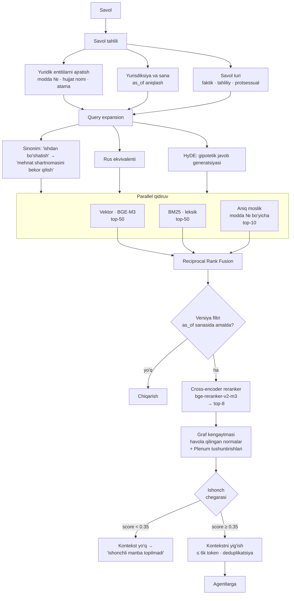

# 04 — RAG tizimi

## 1. Nima uchun yuridik RAG boshqacha

Standart RAG: savol → embedding → eng o'xshash 5 ta chunk → LLM. Yuridik sohada bu yetarli emas, chunki:

| Yuridik talab | Standart RAG nima qiladi | Bizga nima kerak |
|---------------|--------------------------|------------------|
| "234-modda" aniq topilishi | Semantik o'xshashlik raqamni o'tkazib yuborishi mumkin | **Leksik qidiruv** (BM25) parallel |
| Faqat amaldagi norma | Barcha versiyalarni qaytaradi | **Versiya filtri** |
| Havola qilingan normalar ham kerak | Faqat to'g'ridan-to'g'ri moslikni beradi | **Graf kengaytmasi** |
| Iqtibos aniq bo'lishi | Chunk matni qaytadi, manba noaniq | **To'liq metadata zanjiri** |
| Rus/o'zbek aralash so'rov | Bir tilda qidiradi | **Ko'p tilli embedding** |
| "Bilmayman" deyish | Har doim nimadir qaytaradi | **Ishonch chegarasi** |

## 2. To'liq oqim



## 3. Embedding modeli: BGE-M3

| Nomzod | O'zbek | Ko'p tillilik | Hajm | Maks. uzunlik | Verdikt |
|--------|--------|---------------|------|---------------|---------|
| **BGE-M3** | ✅ Yaxshi | 100+ til | 2.2 GB (fp16) | 8192 | **Tanlandi** |
| multilingual-e5-large | ✅ O'rtacha | 100 til | 2.2 GB | 512 | Kontekst qisqa |
| LaBSE | ⚠️ Zaif retrieval | 109 til | 1.8 GB | 256 | Bitext uchun mo'ljallangan |
| OpenAI text-embedding-3 | ✅ Yaxshi | ko'p | API | 8191 | Oflayn ishlamaydi |

**BGE-M3 nima uchun:** bir modelning o'zi **uchta rejimda** ishlaydi — dense (semantik), sparse (leksik, BM25 ga o'xshash) va multi-vector (ColBERT uslubida). Ya'ni gibrid qidiruvni bitta model bilan qurish mumkin. Plus 8192 token kontekst — uzun yuridik moddalar to'liq sig'adi.

O'zbek tili uchun BGE-M3 xatti-harakati Faza 2 da o'lchanadi. Agar recall < 85% bo'lsa — o'zbek yuridik juftliklarida embedding **fine-tune** qilinadi (contrastive learning, ~10k juftlik yetarli).

## 4. Gibrid qidiruv va RRF

Uchta qidiruv natijasi **Reciprocal Rank Fusion** bilan birlashtiriladi:

```
RRF_score(d) = Σ  w_i / (k + rank_i(d))        k = 60
              i∈{vektor, bm25, aniq}
```

Vaznlar savol turiga qarab o'zgaradi:

| Savol turi | Vektor | BM25 | Aniq moslik |
|------------|--------|------|-------------|
| Faktik ("MMT stavkasi") | 0.3 | 0.5 | 0.2 |
| Modda so'rovi ("FK 234-modda") | 0.1 | 0.2 | **0.7** |
| Tahliliy ("bu shartnoma haqiqiymi") | **0.6** | 0.3 | 0.1 |
| Protsessual ("apellyatsiya muddati") | 0.4 | 0.4 | 0.2 |

Nima uchun RRF va oddiy ball qo'shish emas: vektor ballari (kosinus, 0–1) va BM25 ballari (chegarasiz) turli shkalada. RRF faqat **o'rinni** ishlatadi, shuning uchun normalizatsiya kerak emas.

## 5. Versiya filtri

Bu yuridik RAG ning ajratuvchi xususiyati.

```python
def version_filter(chunks, as_of: date | None = None):
    ref = as_of or date.today()
    return [
        c for c in chunks
        if c.valid_from <= ref
        and (c.valid_to is None or c.valid_to > ref)
        and c.status == "in_force"
    ]
```

Foydalanuvchi tarixiy holatni so'rashi mumkin:

```bash
uzlegal ask "Ishdan bo'shatish tartibi qanday edi?" --as-of 2021-06-01
```

Bu holda filtr 2021-06-01 da amalda bo'lgan versiyani qaytaradi va javobda aniq ko'rsatiladi: *"2021-yil 1-iyun holatiga ko'ra"*.

**Qattiq kafolat:** `as_of` ko'rsatilmasa, bekor qilingan norma **hech qachon** kontekstga tushmaydi. Bu texnik cheklov, model xohishiga bog'liq emas.

## 6. Graf kengaytmasi

Topilgan modda o'zicha yetarli bo'lmasligi mumkin. Graf orqali qo'shiladi:

| Bog'lanish turi | Qo'shiladimi | Ball ko'paytuvchisi |
|-----------------|--------------|---------------------|
| `references` (havola qilingan modda) | ✅ 1 daraja | 0.7 |
| `explained_by` (Plenum tushuntirishi) | ✅ Har doim | 0.9 |
| `amended_by` (o'zgartiruvchi hujjat) | ⚠️ Faqat `as_of` so'ralganda | 0.5 |
| `implemented_by` (amalga oshirish tartibi) | ✅ Agar protsessual savol bo'lsa | 0.6 |
| `similar_cases` (o'xshash sud amaliyoti) | ✅ Maks 2 ta | 0.5 |

Kengaytma **1 daraja** bilan cheklangan. 2 daraja qilinsa kontekst portlaydi (yuridik hujjatlar zich bog'langan).

## 7. Kontekstni yig'ish

6k token byudjeti quyidagicha taqsimlanadi:

```
┌─────────────────────────────────────────────────┐
│ Asosiy normalar (top-4 rerank)          ~3000 t │
├─────────────────────────────────────────────────┤
│ Plenum tushuntirishlari                 ~1200 t │
├─────────────────────────────────────────────────┤
│ Havola qilingan normalar                ~1000 t │
├─────────────────────────────────────────────────┤
│ Sud amaliyoti (agar tegishli)            ~800 t │
└─────────────────────────────────────────────────┘
```

Har bir bo'lak aniq belgi bilan beriladi, model manbani chalkashtirmasligi uchun:

```
=== [C1] Fuqarolik kodeksi, 234-modda, 1-qism (2024-04-01 dan amalda) ===
Mulkdor oʻzgalarning qonunsiz egaligidagi mulkni talab qilib olishga haqli.
=== manba: https://lex.uz/docs/111181#234 ===

=== [C2] Oliy sud Plenumi qarori №14, 7-band (2018-06-15) ===
Vindikatsiya daʼvosi qoʻzgʻatilganda sudlar ...
=== manba: https://lex.uz/docs/3814062 ===
```

Agentlar `[C1]`, `[C2]` belgilariga havola qiladi. Bu **groundedness gate** ni deterministik qiladi: da'vodagi `[C1]` haqiqiy chunkga bog'lanadi va tekshiriladi.

## 8. Ishonch chegarasi va rad etish

Yuridik tizimda "bilmayman" — **to'g'ri javob**. Chegaralar:

| Holat | Harakat |
|-------|---------|
| Eng yaxshi rerank ball < 0.35 | "Ishonchli manba topilmadi" — agentlar chaqirilmaydi |
| Top-3 ball < 0.5 | Javob beriladi, lekin "past ishonch" bayrog'i bilan |
| Savol doiradan tashqari (boshqa davlat huquqi) | Rad etish + tushuntirish |
| Savol yuridik emas | Yumshoq rad etish |
| Ziddiyatli manbalar topildi | **Ikkalasini ham ko'rsatish** + kolliziyani belgilash |

Oxirgi holat muhim: agar ikki norma bir-biriga zid bo'lsa (bu real hodisa), tizim birini tanlamaydi — **kolliziyani ko'rsatadi** va professor agenti uni tahlil qiladi (`lex specialis`, `lex posterior`, yuridik kuch ierarxiyasi).

## 8A. ⚠️ O'LCHANGAN NATIJALAR (2026-08-09)

> Birinchi ishlaydigan indeks qurildi: Fuqarolik kodeksi, 387 modda → 334 chunk.
> Quyidagi raqamlar real o'lchov, baho emas.

### Ishlash

| Ko'rsatkich | Baho edi | **O'lchandi** | Izoh |
|-------------|---------:|--------------:|------|
| Embedding (BGE-M3, MPS) | 40 chunk/s | **4.1 chunk/s** | ❌ **10× sekin** |
| Embedding (bir xil qisqa matn) | — | 8.8 chunk/s | Uzun chunklar sekinlashtiradi |
| Model yuklash | — | ~20 s | Bir marta |
| Retrieval (gibrid, 334 chunk) | ≤ 600 ms | **220–360 ms** | ✅ Bahodan yaxshi |
| Indeks hajmi | — | 334 chunk ≈ 2.6 MB | |

**250 000 chunk uchun ekstrapolyatsiya: ~17 soat.** Bu bir martalik kechalik
ish sifatida maqbul, chunki inkremental yangilanishda faqat o'zgargan
hujjatlar qayta hisoblanadi (`sha256`).

Agar tezroq kerak bo'lsa: bulutda GPU (~30 daqiqa, ~$2) yoki kichikroq
embedding modeli. Hozircha zaruriyat yo'q.

### Chunking natijasi

| Ko'rsatkich | Qiymat |
|-------------|--------|
| Moddalar → chunklar | 387 → 334 |
| Turlari | 297 modda, 30 birlashtirilgan, 7 qism |
| Token: median / o'rtacha / maks | 187 / 241 / 1316 |
| 800 tokendan katta | 7 ta |
| Bo'sh yoki nuqsonli | 0 |

800 dan katta 7 ta chunk — bu **ataylab**: ular raqamlanmagan uzun moddalar
bo'lib, bo'linsa mantiqiy butunlik buzilardi. Yuridik matnda to'liqlik
uzunlik chegarasidan muhimroq.

### Qidiruv sifati (dastlabki)

| So'rov | Natija |
|--------|--------|
| `Статья 234` | ✅ 234-modda — 1-o'rin |
| `юридическое лицо учредительные документы` | ✅ 43-modda — 1-o'rin |
| `vindikatsiya da'vosi nima` | ⚠️ 228-modda — 2-o'rin (to'g'ri modda, lekin 1-emas) |
| `мулкдорнинг ҳуқуқлари` (o'zbekcha) | ❌ Tegishsiz natijalar |

---

## 8B. ✅ HAL QILINDI: o'zbek korpusi topildi

> Oldingi versiyada bu bo'lim «korpus rus tilida» blokerini tavsiflardi.
> Bloker **2026-08-09 da hal qilindi.**

### Sabab

lex.uz da til nashrlari **alohida hujjatlar**, tarjima emas:

| Nashr | ID | Manzil |
|-------|-----|--------|
| Гражданский кодекс (rus) | `111181` | `/ru/docs/111181` |
| Fuqarolik kodeksi (o'zbek lotin) | **`-111189`** | `/uz/docs/-111189` |

**O'zbek (lotin) nashrlari manfiy ID bilan keladi.** URL dagi `/uz/` yoki
`/ru/` prefiksi faqat interfeys tilini o'zgartiradi — matn ID bilan
belgilanadi. Shuning uchun `/uz/docs/111181` ham rus tilida qaytaradi.

### Kashfiyot API si

Hujjatlarni topish mexanizmi aniqlandi:

    https://lex.uz/uz/search/nat?query=<so'z>&lang=<til>&form_id=<shakl>&status=<holat>

| Parametr | Qiymatlar |
|----------|-----------|
| `lang` | `4` O'ZB (lotin) · `3` ЎЗБ (kirill) · `1` РУС · `2` ENG |
| `form_id` | `4131` Konstitutsiya · `3964` Kodeks · `3968` Qonun · `3973` Farmon · `3972` Qaror |
| `status` | `Y` amaldagi · `R` kuchini yo'qotgan · `N` amalda emas |

`query` majburiy — bo'sh so'rov 302 beradi.

Shu orqali **20 ta amaldagi kodeks** o'zbek lotin tilida topildi va
`PRIORITY_DOCS` ga yozildi. Ro'yxat qo'lda emas, `uzlegal kb discover`
buyrug'i bilan qayta yaratiladi.

### Parserdagi ikki tuzatish

1. **Manfiy element ID lari.** O'zbek nashrlarida `id="-5443895"`.
   `(\d+)` regexi minusni qamramasdi va butun hujjat bo'sh ajratilardi.
2. **O'zbekcha tahrir izohlari.** Ular boshqa shaklda keladi:
   `(1-moddaning nomi … OʻRQ-683-sonli Qonuni tahririda — …)`.
   Modda deb hisoblanib, haqiqiy moddani ikkiga bo'lardi.

### Natija (o'zbek korpusi, 3 kodeks)

| Hujjat | Moddalar | Chunklar |
|--------|---------:|---------:|
| Fuqarolik kodeksi (1-qism) | 386 | 382 |
| Mehnat kodeksi | 581 | 580 |
| Oila kodeksi | 220 | 208 |
| **Jami** | **1187** | **1170** |

Barchasi: 0 ogohlantirish, 0 bo'sh tana, kirill qoldig'i yo'q, apostroflar
kanonik (`Oʻzbekiston` — U+02BB).

### Qidiruv sifati (o'zbekcha so'rovlar)

| So'rov | Natija |
|--------|--------|
| `vindikatsiya daʼvosi` | ✅ FK 228-modda — 1-o'rin (aynan vindikatsiya moddasi) |
| `Mehnat shartnomasi qanday asoslarda bekor qilinadi` | ✅ MK 170-modda — 1-o'rin |
| `sinov muddati qancha` | ✅ MK 130-131-modda — 1-o'rin |
| `nikohni bekor qilish tartibi` | ✅ Oila kodeksi 50-modda — 1-o'rin |
| `FK 234-modda` | ✅ Fuqarolik kodeksi 234-modda |
| `MK 170-modda` | ✅ Mehnat kodeksi 170-modda |

Kechikish: 50–420 ms (birinchi so'rovda +15 s model yuklash).

---

## 8C. Uchinchi kanal: aniq moslik

Dastlab faqat vektor + BM25 qurilgan edi va `FK 234-modda` so'rovi
**noto'g'ri modda** qaytardi.

Sabab: BM25 uchun «modda» so'zi har bir chunk sarlavhasida uchraydi va uning
IDF si nolga yaqin; «234» esa boshqa moddalarning matnida havola sifatida
ko'p marta keladi. Leksik ball bu holatda ma'noli signal bermaydi.

Yechim — metadata bo'yicha **to'g'ridan-to'g'ri qidiruv**:

```python
article, doc_hint = extract_article_ref(query)   # ("234", "fuqarolik kodeksi")
exact = index.search_article(article, doc_hint)  # metadata filtri
```

RRF da bu kanal vazni **2.0** — foydalanuvchi modda raqamini aytgan bo'lsa,
u aynan shuni so'ragan, taxmin qilishning hojati yo'q.

**Hujjat ishorasi qat'iy:** «FK 234-modda» so'ralganda Mehnat kodeksidagi
234-modda **umuman ko'rsatilmaydi**. Yuristlar uchun bir xil raqamli
moddalarni aralashtirish chalkashlik manbai. Qisqartmalar qo'llab-quvvatlanadi:
`FK`, `MK`, `JK`, `JPK`, `FPK`, `OK`, `SK` va ruscha `ГК`, `ТК`, `УК`.

---

## 9. Baholash

RAG qatlami agentlardan **mustaqil** baholanadi. Bu muhim: agar yakuniy javob yomon bo'lsa, retrieval aybdormi yoki modelmi — bilish kerak.

| Metrika | Ta'rif | Maqsad |
|---------|--------|--------|
| **Recall@10** | To'g'ri chunk top-10 da | ≥ 90% |
| **Recall@3** | To'g'ri chunk top-3 da | ≥ 80% |
| **MRR** | Mean Reciprocal Rank | ≥ 0.75 |
| **nDCG@8** | Reranking sifati | ≥ 0.82 |
| **Version accuracy** | Amaldagi versiya qaytdimi | ≥ 99% |
| **Deprecated leak** | Bekor qilingan chunk chiqdimi | **0%** |
| **Latency p95** | To'liq retrieval | ≤ 600 ms |

Test to'plami: 500 ta savol → to'g'ri chunk juftligi, yurist tomonidan belgilangan.

```bash
uzlegal eval retrieval --suite retrieval-gold-v1 --out reports/rag-eval.md
```

## 10. Saqlash tanlovi

| Komponent | Texnologiya | Sabab |
|-----------|-------------|-------|
| Vektor indeks | **LanceDB** | Faylga asoslangan, server kerak emas, mmap, oflayn ishlaydi |
| Leksik indeks | **Tantivy** (yoki `rank_bm25`) | Tez, o'zbek tokenizatsiyasi sozlanadi |
| Metadata | **SQLite** (local) / Postgres (server) | Murakkab filtrlar, tranzaksiyalar |
| Hujjat grafi | SQLite jadval (yoki `networkx` xotirada) | Graf kichik (~1M qirra) |
| Xom hujjatlar | Fayl tizimi / S3 | O'zgarmas arxiv |

Nima uchun LanceDB va Qdrant/Weaviate emas: `local-dev` profilida **hech qanday server jarayoni ishlamasligi** kerak. LanceDB — kutubxona, Docker talab qilmaydi. Server profilida Qdrant ga o'tish mumkin (`VectorStore` interfeysi bir xil).

## 11. Keyingi hujjat

→ [05 — Fine-tuning](05-finetuning.md)
