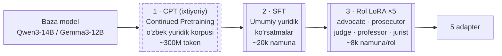
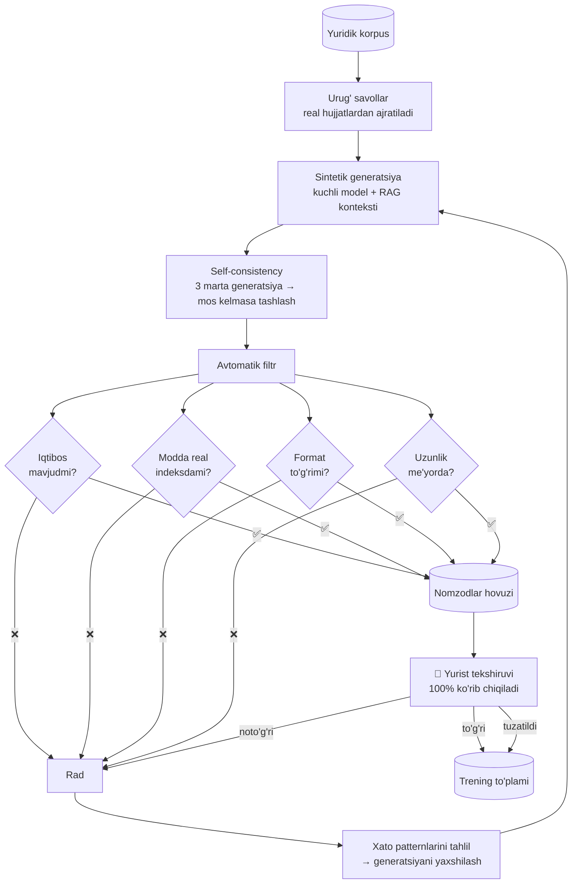

# 05 — Fine-tuning

## 1. Nima uchun fine-tuning kerak (va nima uchun u ikkinchi darajali)

RAG bilan tizim allaqachon ishlaydi — taxminan 65–75% aniqlik. Fine-tuning quyidagilarni beradi:

| Fine-tuning **beradi** | Fine-tuning **bermaydi** |
|------------------------|--------------------------|
| Rol uslubi (advokat vs sudya ohangi) | Yangi huquqiy fakt (u RAG dan) |
| O'zbek yuridik tili ravonligi | Qonun o'zgarishlariga moslashish |
| Chiqish formatiga qat'iy rioya | Iqtibos aniqligi (u gate dan) |
| Iqtibos bilan ishlash odati | Faktik to'g'rilik |
| "Bilmayman" deyishni o'rganish | |
| Debate protokolida ishtirok etish | |

Ya'ni: **fine-tuning modelga qanday gapirishni o'rgatadi, nima gapirishni emas.** Bu ajratish [T1 tamoyili](01-architecture.md#1-dizayn-tamoyillari) ning davomi.

## 2. Uch bosqichli moslashtirish



### Bosqich 1 — CPT (Continued Pretraining), ixtiyoriy

Baza modelning o'zbek yuridik tilidagi ravonligi past bo'lsa qo'llaniladi. Xom yuridik matn ustida davom ettirilgan pretraining (savol-javob emas, shunchaki matn).

**Qaror mezoni:** Faza 0 baholashida o'zbek tili balli < 3.5/5 bo'lsa → CPT qilinadi.

- Ma'lumot: ~300M token tozalangan yuridik matn (Faza 1 dan)
- LoRA r=64 (yuqori rang — ko'proq bilim sig'imi), yoki to'liq FT bulutda
- 1 epoch, past LR (1e-5)
- **Xavf:** catastrophic forgetting — model umumiy qobiliyatini yo'qotishi. Oldini olish: LoRA ishlatish, replay data (10% umumiy matn), har 500 qadamda umumiy benchmark tekshirish

### Bosqich 2 — Umumiy yuridik SFT

Barcha rollar uchun umumiy poydevor. Modelga o'rgatiladi:

- Berilgan `[C1]`, `[C2]` kontekstidan javob qurish
- Har bir da'voga iqtibos qo'yish
- Kontekstda javob yo'q bo'lsa — "bilmayman" deyish
- Yuridik struktura: fakt → norma → qo'llash → xulosa (IRAC uslubi)
- O'zbek yuridik terminologiyasi

Natija: `uzlegal-base-sft` — barcha rol adapterlarining ota-onasi.

### Bosqich 3 — Rol LoRA lari

Har bir rol o'z adapterini oladi, `uzlegal-base-sft` ustiga.

## 3. Trening ma'lumoti

Bu fazaning **eng qimmat qismi** — GPU emas, inson vaqti.

### Hajm va manba

| Bosqich | Namuna soni | Manba |
|---------|-------------|-------|
| SFT umumiy | 20 000 | 60% sintetik + 40% real hujjatdan olingan |
| `jurist` | 8 000 | Tahliliy savollar |
| `advocate` | 8 000 | Real himoya arizalari + sintetik |
| `prosecutor` | 8 000 | Ayblov xulosalari + sintetik |
| `judge` | 8 000 | **Real sud qarorlari** (eng qimmatli manba) |
| `professor` | 6 000 | Ilmiy sharhlar, darsliklar |

`judge` roli uchun real sud qarorlari oltin manba: ular allaqachon "dalillarni tortish → xulosa" strukturasida yozilgan.

### Generatsiya quvuri



**Bu qadamni qisqartirib bo'lmaydi.** Tekshirilmagan yuridik trening ma'lumoti modelni ishonch bilan xato qilishga o'rgatadi — bu tekshirilmagan modeldan ham yomonroq, chunki xato *ishonarli* bo'lib qoladi.

Yurist vaqti hisobi: 46 000 namuna × 2 daqiqa = **~1 530 soat**. Bu real emas.

**Amaliy yechim — bosqichma-bosqich:**

| Iteratsiya | Namuna | Yurist vaqti | Maqsad |
|------------|--------|--------------|--------|
| v0.1 | 2 000 (400/rol) | ~70 soat | Ishlaydigan prototip |
| v0.2 | 8 000 | ~200 soat (qisman namunaviy tekshiruv) | Sifat sakrashi |
| v1.0 | 25 000 | ~300 soat (avtomatik filtr yaxshilangan) | Ishlab chiqarish |

v0.1 dan keyin model o'zi generatsiya sifatini oshiradi (self-improvement loop) — tekshirish tezlashadi.

### Namuna format

```json
{
  "id": "adv-00412",
  "role": "advocate",
  "context": [
    {"tag": "C1", "chunk_id": "uz-fk-1996:234:1:v3", "text": "Mulkdor oʻzgalarning..."},
    {"tag": "C2", "chunk_id": "uz-plenum-14-2018:7", "text": "Vindikatsiya daʼvosi..."}
  ],
  "question": "Mijozim 3 yil oldin sotib olgan uyni haqiqiy mulkdor talab qilmoqda. Himoya pozitsiyasi qanday?",
  "answer": "Himoya uch yoʻnalishda quriladi.\n\n**1. Vijdonli egalik.** [C1] ga koʻra vindikatsiya...",
  "citations": ["C1", "C2"],
  "meta": {
    "source": "synthetic+verified",
    "verified_by": "expert-03",
    "verified_at": "2026-09-14",
    "difficulty": "medium",
    "legal_area": "fuqarolik"
  }
}
```

## 4. Rol spetsifikatsiyalari

Har bir rol turli xatti-harakatga o'qitiladi. Farqlar aniq va o'lchanadigan:

| Rol | Harorat | Uslub | Majburiy struktura | Xarakterli fe'l |
|-----|---------|-------|--------------------|-----------------|
| `jurist` | 0.2 | Neytral, quruq | Faktlar → tegishli normalar → tahlil | "belgilangan", "nazarda tutilgan" |
| `advocate` | 0.5 | Ishonarli, mijoz foydasiga | Pozitsiya → asos → muqobil yo'llar → risklar | "haqli", "asos yo'q", "e'tiborga olinishi lozim" |
| `prosecutor` | 0.4 | Qat'iy, ayblov | Buzilish → dalil → huquqiy oqibat | "buzgan", "javobgarlik", "isbotlangan" |
| `professor` | 0.6 | Ilmiy, tahliliy | Doktrina → kolliziya → qiyoslash → xulosa | "doktrinada", "kolliziya", "amaliyotda" |
| `judge` | 0.3 | Muvozanatli, rasmiy | Faktlar → tomonlar dalili → norma → qaror | "hisobga olib", "asoslanib", "hal qilinadi" |

`advocate` uchun muhim cheklov: u **mijoz foydasiga argument quradi, lekin qonunni buzmaydi va faktni o'ylab topmaydi**. Trening ma'lumotida bu aniq ko'rsatiladi — kuchsiz pozitsiyani "kuchsiz" deb tan olish namunalari kiritiladi.

To'liq system promptlar: `prompts/*.uz.md`, batafsil [`docs/06-agents.md`](06-agents.md).

## 5. Trening konfiguratsiyasi

```yaml
# configs/training/role-lora.yaml
base_model: models/uzlegal-base-sft-4bit
method: qlora

lora:
  rank: 16              # rol uslubi uchun yetarli; bilim uchun emas
  alpha: 32
  dropout: 0.05
  target_modules: [q_proj, k_proj, v_proj, o_proj, gate_proj, up_proj, down_proj]

training:
  epochs: 2             # 3+ da overfitting boshlanadi
  batch_size: 1
  grad_accum: 8         # effektiv batch = 8
  learning_rate: 1e-4
  lr_schedule: cosine
  warmup_steps: 100
  max_seq_len: 4096     # kontekst + savol + javob
  grad_checkpointing: true

eval:
  every_n_steps: 200
  holdout_ratio: 0.05
  early_stop_patience: 3
```

### Trening buyrug'i

```bash
uzlegal train lora \
  --role advocate \
  --data data/sft/advocate-v0.2.jsonl \
  --config configs/training/role-lora.yaml \
  --out adapters/advocate-v0.2

# yoki to'g'ridan-to'g'ri MLX bilan
mlx_lm.lora \
  --model models/uzlegal-base-sft-4bit \
  --train --data data/sft/advocate \
  --iters 2000 --batch-size 1 --lora-layers 16 \
  --adapter-path adapters/advocate-v0.2
```

### Nima uchun rank 16

| Rank | Params | Hajm | Qachon |
|------|--------|------|--------|
| 8 | ~10M | 20 MB | Juda oddiy uslub moslashuvi |
| **16** | ~20M | 40 MB | **Rol uslubi — tanlangan** |
| 32 | ~40M | 80 MB | Murakkab format + uslub |
| 64 | ~80M | 160 MB | Yangi bilim (CPT uchun) |

Rol adapteri **yangi bilim o'rgatmaydi** — u faqat uslub va strukturani o'zgartiradi. Rank 16 buning uchun yetarli, ortiqchasi overfitting va xotira sarfi.

## 6. Overfitting va rol qulflanishi

Ikkita real xavf:

**Xavf 1 — Rol qulflanishi (role lock-in).** Advokat adapteri shu qadar "himoyaviy" bo'lib qoladiki, mijoz pozitsiyasi umuman kuchsiz bo'lganda ham uni himoya qiladi.

*Yechim:* trening ma'lumotining **15%** i "pozitsiya kuchsiz" namunalari — advokat halol ravishda "bu yo'nalishda istiqbol yo'q, quyidagi muqobilni ko'rib chiqing" deydi.

**Xavf 2 — Iqtibos kargo-kulti.** Model iqtibos *formatini* o'rganadi, lekin uni mazmun bilan bog'lamaydi — `[C1]` ni tasodifiy qo'yadi.

*Yechim:* trening da negativ namunalar — kontekst savol bilan bog'liq emas → to'g'ri javob "berilgan manbalarda bu savolga javob yo'q". Plus groundedness gate bu xatoni ishlab chiqarishda tutadi.

## 7. Baholash (fine-tuning bosqichi)

Har bir adapter alohida baholanadi:

| Metrika | Usul | Maqsad |
|---------|------|--------|
| Rol sodiqligi | LLM-judge: "bu javob advokatnikimi?" | ≥ 90% |
| Format rioyasi | Deterministik parser | ≥ 98% |
| Iqtibos qamrovi | Da'volarning necha % i iqtibosli | ≥ 95% |
| Iqtibos to'g'riligi | Iqtibos da'voni qo'llab-quvvatlaydimi | ≥ 92% |
| Rad etish to'g'riligi | Javobsiz kontekstda "bilmayman" | ≥ 85% |
| O'zbek tili ravonligi | Inson bahosi, 100 namuna | ≥ 4.0/5 |
| Umumiy qobiliyat regressiyasi | Umumiy benchmark | tushish ≤ 5% |

Oxirgi metrika muhim: adapter modelni yuridik sohada yaxshilashi, lekin umumiy fikrlashini buzmasligi kerak.

## 8. Adapter versiyalash

```
adapters/
├── advocate/
│   ├── v0.1/  (2000 namuna,  rol sodiqligi 0.81)
│   ├── v0.2/  (8000 namuna,  rol sodiqligi 0.91)
│   └── current -> v0.2
├── prosecutor/
...
└── registry.yaml
```

`registry.yaml` — har bir adapterning metadata va baholash natijalari. Tizim yuklashda `current` ni oladi; A/B test uchun aniq versiya ko'rsatiladi.

## 9. Vaqt va xarajat

| Ish | Vaqt | Xarajat |
|-----|------|---------|
| Dataset generatsiyasi (v0.1, 2k) | 1 hafta | ~$50 (API) |
| Yurist tekshiruvi (v0.1) | 2 hafta | Ekspert vaqti |
| SFT trening (umumiy) | 12 soat local / 2 soat bulut | ~$4 |
| 5 rol LoRA (local) | ~50 soat | $0 |
| 5 rol LoRA (bulut A100) | ~6 soat | ~$12 |
| Baholash | 3 kun | ~$30 |
| **Jami v0.1** | **~4 hafta** | **~$100 + ekspert vaqti** |

## 10. Keyingi hujjat

→ [06 — Agentlar va orkestratsiya](06-agents.md)
