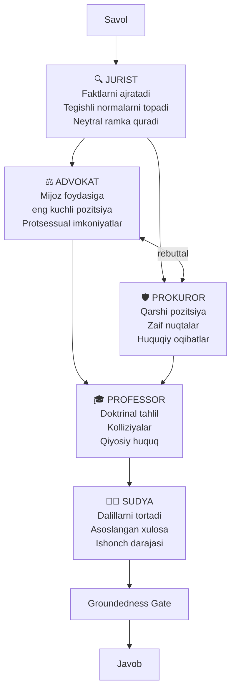
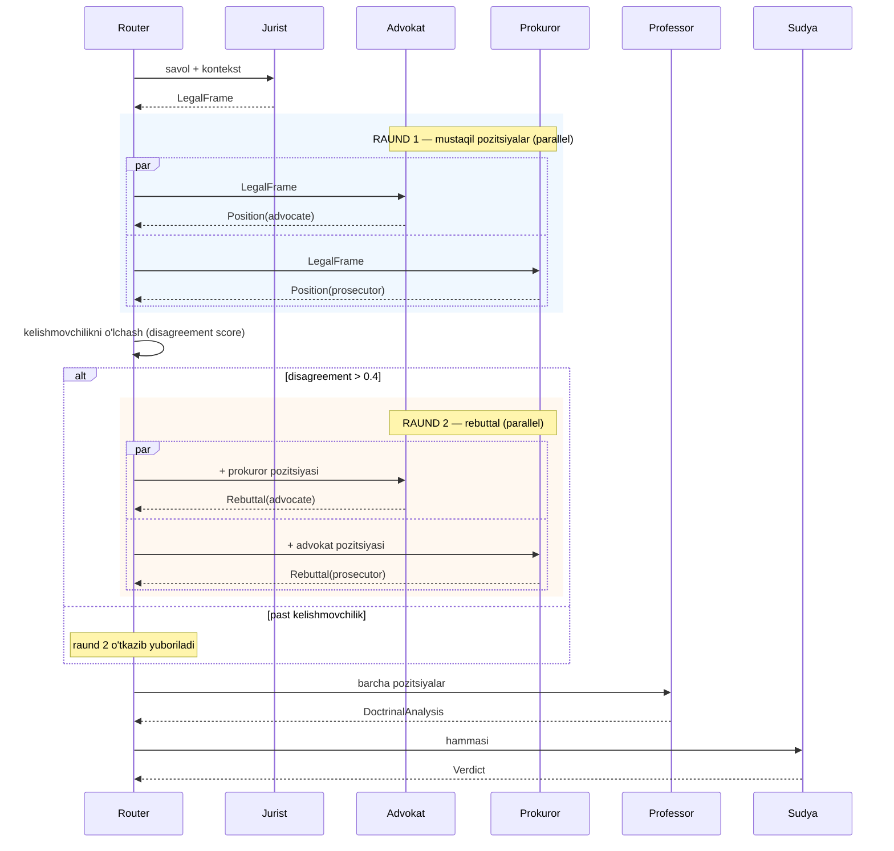

# 06 — Agentlar va orkestratsiya

## 1. Nima uchun ko'p agent

Bitta model bitta savolga bitta javob beradi va u javobning **bir tomonlama** bo'lishi tabiiy — model eng ehtimolli javobni tanlaydi va uni qo'llab-quvvatlovchi dalillarni topadi (confirmation bias).

Real huquqiy jarayonda esa haqiqat **to'qnashuvdan** chiqadi: advokat bir tomonni, prokuror ikkinchi tomonni himoya qiladi, sudya tortadi. Bu arxitektura shu strukturani takrorlaydi.

**O'lchanadigan foyda** (Faza 5 da tekshiriladi): murakkab nizoli savollarda ko'p-agentli javob bitta agent javobiga qaraganda yurist bahosida ~15–25% yuqori ball oladi. Oddiy faktik savollarda esa **farq yo'q** — shuning uchun router bor.

## 2. Rollar



### Rol shartnomalari

Har bir agent qat'iy kirish/chiqish shartnomasiga ega. Bu ularni **mustaqil testlash** imkonini beradi.

| Agent | Kirish | Chiqish | Iqtibos majburiyati |
|-------|--------|---------|---------------------|
| `jurist` | savol + RAG konteksti | `LegalFrame` | Har bir norma |
| `advocate` | `LegalFrame` + mijoz pozitsiyasi | `Position` | Har bir da'vo |
| `prosecutor` | `LegalFrame` + `advocate.Position` | `Position` | Har bir da'vo |
| `professor` | `LegalFrame` + ikkala `Position` | `DoctrinalAnalysis` | Norma uchun; doktrina uchun ixtiyoriy |
| `judge` | Hammasi | `Verdict` | Xulosa asoslari |

```python
class LegalFrame(BaseModel):
    facts: list[str]                    # ajratilgan faktlar
    legal_questions: list[str]          # huquqiy savollar
    applicable_norms: list[Citation]    # tegishli normalar
    unknowns: list[str]                 # yetishmayotgan ma'lumot

class Position(BaseModel):
    stance: str                         # asosiy pozitsiya
    arguments: list[Argument]           # har biri iqtibosli
    weaknesses: list[str]               # o'z pozitsiyasining zaif joylari ← majburiy
    confidence: float                   # 0.0–1.0

class Argument(BaseModel):
    claim: str
    citations: list[str]                # ["C1", "C4"]
    strength: Literal["strong","moderate","weak"]

class Verdict(BaseModel):
    conclusion: str
    reasoning: list[str]
    accepted_arguments: list[str]       # qaysi dalillar qabul qilindi
    rejected_arguments: list[str]       # va nima uchun rad etildi
    confidence: float
    caveats: list[str]                  # noaniqlik, yetishmayotgan fakt
    citations: list[Citation]
```

**`weaknesses` maydoni majburiy** — advokat ham, prokuror ham o'z pozitsiyasining zaif tomonini aytishga majbur. Bu rol qulflanishiga qarshi asosiy mexanizm.

## 3. Debate protokoli

Agentlar erkin suhbatlashmaydi — bu konvergensiya kafolatlamaydi va xarajat oldindan bilinmaydi. Buning o'rniga **qat'iy raundli protokol**:



### Kelishmovchilik ballini o'lchash

```python
def disagreement(a: Position, p: Position) -> float:
    return (
        0.4 * abs(a.confidence - p.confidence) +
        0.4 * (1 - citation_overlap(a, p)) +      # bir xil normalarga tayanadimi
        0.2 * conclusion_distance(a, p)            # semantik masofa
    )
```

Chegara `0.4`. Undan past bo'lsa raund 2 o'tkazib yuboriladi — agentlar aslida rozi, munozara qilishning ma'nosi yo'q. Bu **o'rtacha 30% vaqt tejaydi**.

### Nima uchun maksimum 2 raund

3+ raundda kuzatiladi:
- Agentlar bir xil dalilni qayta ifodalay boshlaydi (yangi ma'lumot yo'q)
- Kontekst o'sadi, sifat tushadi (lost-in-the-middle)
- Xarajat chiziqli o'sadi, foyda esa yo'q

Empirik: raund 1→2 sifat +12%, raund 2→3 +2%, raund 3→4 −1%.

## 4. Orkestratsiya (LangGraph)

Graf sifatida ifodalanadi — bu **kuzatiluvchanlik**, **qayta boshlash** va **shartli oqim** beradi.

```python
from langgraph.graph import StateGraph, END

class ConsultState(TypedDict):
    question: str
    mode: Literal["simple", "standard", "complex"]
    as_of: date | None
    context: list[Chunk]
    frame: LegalFrame | None
    positions: dict[str, Position]
    rebuttals: dict[str, Position]
    doctrine: DoctrinalAnalysis | None
    verdict: Verdict | None
    trace: list[TraceEvent]

g = StateGraph(ConsultState)

g.add_node("route",      route_by_complexity)
g.add_node("retrieve",   hybrid_retrieve)
g.add_node("jurist",     agent("jurist"))
g.add_node("debate_r1",  parallel(agent("advocate"), agent("prosecutor")))
g.add_node("debate_r2",  parallel(rebuttal("advocate"), rebuttal("prosecutor")))
g.add_node("professor",  agent("professor"))
g.add_node("judge",      agent("judge"))
g.add_node("gate",       groundedness_gate)

g.set_entry_point("route")
g.add_edge("route", "retrieve")

# Retrieval ishonch chegarasi
g.add_conditional_edges("retrieve", lambda s:
    "insufficient" if s["context"] == [] else "ok",
    {"insufficient": "gate", "ok": "jurist"})

# Rejimga qarab shoxlanish
g.add_conditional_edges("jurist", lambda s: s["mode"],
    {"simple": "gate", "standard": "professor", "complex": "debate_r1"})

# Kelishmovchilikka qarab raund 2
g.add_conditional_edges("debate_r1", lambda s:
    "r2" if disagreement(s["positions"]) > 0.4 else "skip",
    {"r2": "debate_r2", "skip": "professor"})

g.add_edge("debate_r2", "professor")
g.add_edge("professor",  "judge")
g.add_edge("judge",      "gate")
g.add_edge("gate",       END)

app = g.compile(checkpointer=SqliteSaver("traces.db"))
```

### Checkpointing nima beradi

- **Qayta boshlash:** agent xato bersa, butun quvurni emas, shu tugundan davom ettirish
- **Audit:** har bir qadam saqlanadi — yuridik tizimda majburiy
- **Debug:** "nima uchun bunday javob berdi?" savoliga aniq javob
- **Insonni jalb qilish:** har qanday tugundan keyin to'xtatib, yurist aralashuvi mumkin

## 5. Adapter almashtirish

Barcha agentlar bitta baza modelni bo'lishadi. Orkestrator adapterlarni ketma-ket almashtiradi:

```python
class AdapterPool:
    def __init__(self, base_model_path: str):
        self.base = load_model(base_model_path)      # 8 GB, bir marta
        self.adapters = {                             # 5 × 40 MB
            role: load_adapter(f"adapters/{role}/current")
            for role in ROLES
        }
        self._active: str | None = None

    @contextmanager
    def role(self, name: str):
        if self._active != name:
            self.base.set_adapter(self.adapters[name])   # ~50 ms
            self._active = name
        yield self.base
```

### Parallellik cheklovi (muhim)

`debate_r1` "parallel" deb yozilgan, lekin **bitta baza modelda haqiqiy parallellik yo'q** — adapter global holat. `local-dev` da bu ketma-ket bajariladi (advokat, keyin prokuror).

Variantlar:

| Profil | Strategiya | Debate vaqti |
|--------|-----------|--------------|
| `local-dev` | Ketma-ket + prefix KV-cache | ~30 s |
| `workstation` | Ikkita model nusxasi (xotira yetsa) | ~18 s |
| `server` | vLLM multi-LoRA (haqiqiy parallel) | ~6 s |

vLLM **bir vaqtda bir necha LoRA** ni xizmat qila oladi — bu server profilining asosiy afzalligi.

## 6. Prefix KV-cache

Debate ning eng katta xarajati — bir xil huquqiy kontekstni besh marta qayta ishlash.

```
┌──────────────────────────────────────────────┬─────────────────┐
│  UMUMIY PREFIKS (bir marta hisoblanadi)      │  ROL QISMI      │
│  tizim prompti + huquqiy kontekst (~6k tok)  │  (~400 tok)     │
└──────────────────────────────────────────────┴─────────────────┘
              ↓ KV-cache saqlanadi                    ↓ har agent uchun
        33 s (bir marta)                        ~2 s (× 5 agent)

Cache siz:  5 × 33 s = 165 s
Cache bilan: 33 s + 5 × 2 s = 43 s        →  ~3.8× tezroq
```

Amalga oshirish:

```python
prefix = system_prompt + format_context(chunks)
kv = model.make_cache(prefix)                 # bir marta

for role in active_roles:
    with pool.role(role):
        out = model.generate(
            role_prompt(role) + question,
            prefix_cache=kv.copy(),           # nusxa — asl buzilmaydi
        )
```

**Shart:** umumiy prefiks barcha agentlarda **bayt-baytga bir xil** bo'lishi kerak, aks holda cache yaroqsiz. Shuning uchun rol prompti prefiksdan **keyin** joylashadi.

## 7. Yangi agent qo'shish

Kod o'zgartirmasdan:

```yaml
# configs/agents/notary.yaml
role: notary
display_name: "Notarius"
adapter: adapters/notary/current
base_temperature: 0.2
system_prompt: prompts/notary.uz.md

retrieval:
  profile: notarial          # qaysi hujjat turlariga ustunlik
  top_k: 6

output_schema: NotarialOpinion

orchestration:
  participates_in_debate: false
  invoked_when: "savol notarial harakatlarga tegishli"
  position_in_graph: after_jurist
```

Ro'yxatdan o'tkazish:

```bash
uzlegal agents register configs/agents/notary.yaml
uzlegal agents list
```

Kelajakdagi rollar: notarius, soliq inspektori, mediator, korporativ yurist, mehnat inspektori.

## 8. Xatolarga chidamlilik

| Nosozlik | Harakat |
|----------|---------|
| Agent noto'g'ri sxemada javob berdi | 2 marta qayta urinish (aniqroq format ko'rsatmasi bilan) → keyin shu agent o'tkazib yuboriladi |
| Agent timeout (> 60 s) | Bekor qilish, sudyaga "pozitsiya olinmadi" deb belgilanadi |
| Retrieval bo'sh | Agentlar chaqirilmaydi, darhol "manba topilmadi" |
| Sudya sintez qila olmadi | Xom pozitsiyalar ko'rsatiladi, "avtomatik xulosa yo'q" ogohlantirishi bilan |
| Model yuklanmadi | Sog'liq tekshiruvi ishga tushishda; xizmat `unhealthy` |
| Gate hamma da'voni o'chirdi | "Ishonchli javob shakllantirilmadi" + topilgan manbalar ro'yxati |

Tamoyil: **tizim hech qachon tasdiqlanmagan javobni ishonchli qilib ko'rsatmaydi.** Buzilgan holatda kamroq ma'lumot beradi, lekin yolg'on aytmaydi.

## 9. Kuzatiluvchanlik (trace)

Har bir maslahat to'liq yoziladi:

```json
{
  "trace_id": "cns_01J8X...",
  "question": "...",
  "mode": "complex",
  "as_of": null,
  "steps": [
    {"node": "retrieve", "ms": 480, "chunks": 8, "top_score": 0.87},
    {"node": "jurist",   "ms": 7200, "tokens_in": 6100, "tokens_out": 380},
    {"node": "debate_r1","ms": 15400, "disagreement": 0.62},
    {"node": "debate_r2","ms": 14900},
    {"node": "professor","ms": 8100},
    {"node": "judge",    "ms": 9600},
    {"node": "gate",     "ms": 1200, "claims": 12, "kept": 11, "dropped": 1}
  ],
  "total_ms": 56880,
  "citations": ["uz-fk-1996:234:1:v3", "uz-plenum-14-2018:7"],
  "confidence": 0.78,
  "model": "uzlegal-14b-v0.2",
  "kb_version": "v2026.09.01"
}
```

Foydalanuvchi UI da "Qanday xulosaga kelindi?" tugmasi orqali bu zanjirni ko'radi. Yuridik tizimda **javobning o'zi yetarli emas — asoslash zanjiri kerak**.

## 10. Keyingi hujjat

→ [07 — Interfeyslar](07-interfaces.md)
