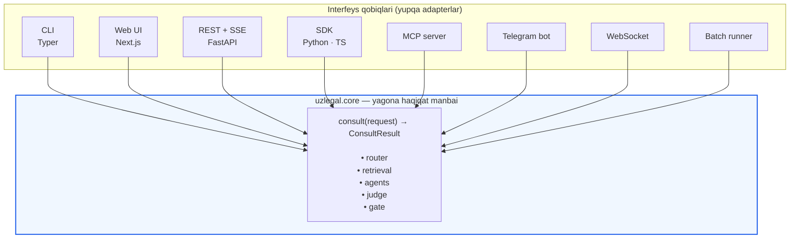
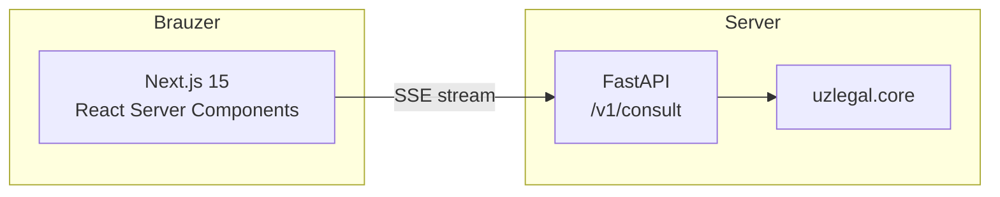

# 07 — Interfeyslar

> Talab: tizim **turli holatlarda** — saytda, terminalda, API orqali va boshqa usullarda ishlashi kerak. Bu hujjat shu talabning arxitektura javobi.

## 1. Asosiy tamoyil: bitta yadro, ko'p qobiq



Har bir qobiq **faqat** ikkita ishni bajaradi:
1. Kirishni `ConsultRequest` ga aylantirish
2. `ConsultResult` ni o'z formatiga chiqarish

Biznes mantiq qobiqda **umuman yo'q**. Yangi interfeys qo'shish = ~150 satr kod.

### Yagona shartnoma

```python
class ConsultRequest(BaseModel):
    question: str
    mode: Literal["auto","simple","standard","complex"] = "auto"
    agents: list[str] | None = None        # None = router hal qiladi
    as_of: date | None = None              # tarixiy holat
    lang: Literal["uz","ru","en"] = "uz"
    client_position: str | None = None     # advokat uchun mijoz pozitsiyasi
    max_tokens: int = 2000
    stream: bool = False
    trace: bool = False

class ConsultResult(BaseModel):
    trace_id: str
    answer: str
    verdict: Verdict | None
    positions: dict[str, Position]
    citations: list[Citation]
    confidence: float
    caveats: list[str]
    mode_used: str
    latency_ms: int
    kb_version: str
    disclaimer: str                        # har doim mavjud
```

---

## 2. Terminal (CLI)

Asosiy ishlab chiquvchi va power-user interfeysi. Oflayn ishlaydi.

### Interaktiv rejim

```bash
$ uzlegal chat

UzLegal-AI v0.2 · model: uzlegal-14b · KB: v2026.09.01 · rejim: auto
Yordam uchun /help, chiqish uchun /exit

› Mehnat shartnomasi qanday asoslarda bekor qilinishi mumkin?

⠋ retrieval (8 manba, 0.5s)
⠙ jurist ████████████ 7.2s
⠹ advokat ⇄ prokuror ██████ 15.4s  (kelishmovchilik: 0.31 → raund 2 o'tkazildi)
⠸ professor ████ 8.1s
⠼ sudya ██████ 9.6s
✓ gate: 12 da'vo → 11 tasdiqlandi, 1 olib tashlandi

XULOSA
Mehnat shartnomasi Mehnat kodeksining 106-moddasida belgilangan
asoslar bo'yicha bekor qilinishi mumkin: [C1]
  1. Tomonlarning kelishuvi bo'yicha
  2. Xodimning tashabbusi bilan
  ...

ISHONCH: 0.84  ·  MANBALAR: 4

[1] Mehnat kodeksi, 106-modda (2023-04-30 dan)  lex.uz/docs/142859#106
[2] Oliy sud Plenumi qarori №23, 5-band          lex.uz/docs/2456123

⚠ Bu yuridik maslahat emas. Malakali yurist bilan tasdiqlang.

› /trace          ← qanday xulosa chiqarilganini ko'rish
› /agent advocate ← faqat advokat pozitsiyasi
› /sources        ← to'liq manba matnlari
› /export md      ← javobni faylga saqlash
```

### Bir martalik (skript uchun)

```bash
# Oddiy
uzlegal ask "MMT stavkasi qancha?"

# JSON — boshqa dasturga uzatish uchun
uzlegal ask "..." --json | jq '.citations[]'

# Muayyan agent
uzlegal ask "..." --agent advocate --client-position "Mijoz to'lovni kechiktirgan"

# Tarixiy holat
uzlegal ask "..." --as-of 2021-06-01

# Rejimni majburlash
uzlegal ask "..." --mode complex

# Streaming (terminal ga oqim)
uzlegal ask "..." --stream
```

### Batch rejim

```bash
# Fayldan savollar, natijalar JSONL ga
uzlegal batch --input questions.txt --output results.jsonl --concurrency 2

# Hujjatni tahlil qilish
uzlegal review contract.pdf --agent jurist --checklist fuqarolik-shartnoma
```

### Boshqaruv buyruqlari

```bash
uzlegal serve --profile local-dev --port 8080     # API + web
uzlegal models list | pull | bench
uzlegal ingest discover | fetch | sync
uzlegal index build | update | stats
uzlegal train lora --role advocate
uzlegal eval run --suite gold-v1
uzlegal agents list | register | test
uzlegal doctor                                     # muhit diagnostikasi
```

### Chiqish kodlari (skriptlar uchun)

| Kod | Ma'no |
|-----|-------|
| 0 | Muvaffaqiyat |
| 1 | Umumiy xato |
| 2 | Noto'g'ri argument |
| 3 | Model yuklanmadi |
| 4 | Bilim bazasi topilmadi |
| 5 | Ishonchli javob shakllantirilmadi (rad etish) |
| 6 | Timeout |

---

## 3. Web UI



### Ekranlar

| Ekran | Vazifa |
|-------|--------|
| **Maslahat** | Asosiy savol-javob, agent progressi jonli ko'rinadi |
| **Manbalar paneli** | Har bir iqtibos yonida — chunk matni, lex.uz havolasi |
| **Munozara ko'rinishi** | Advokat va prokuror pozitsiyalari yonma-yon |
| **Trace** | Qadam-baqadam qanday xulosaga kelingani |
| **Hujjat tahlili** | PDF/DOCX yuklash → tahlil |
| **Tarix** | Oldingi maslahatlar, qidiruv |
| **Taqqoslash** | Bir savolni turli `as_of` sanalarda |

### Munozara ko'rinishi (asosiy UX qarori)

```
┌──────────────────────────┬──────────────────────────┐
│  ⚖️  ADVOKAT             │  🛡️  PROKUROR            │
│  ishonch 0.72            │  ishonch 0.65            │
├──────────────────────────┼──────────────────────────┤
│ • Muddat o'tgan [C1]     │ • Muddat to'xtatilgan[C3]│
│ • Vijdonli egalik [C2]   │ • Vijdonsizlik dalili[C4]│
│                          │                          │
│ Zaif tomon:              │ Zaif tomon:              │
│ Kvitansiya yo'q          │ Guvoh ko'rsatmasi zaif   │
└──────────────────────────┴──────────────────────────┘
              ↓  👨‍⚖️ SUDYA XULOSASI  ↓
┌─────────────────────────────────────────────────────┐
│ Advokatning 1-dalili qabul qilinadi [C1], chunki... │
│ Prokurorning muddat to'xtatilishi haqidagi dalili   │
│ rad etiladi, chunki [C1] ga ko'ra...                │
│                                    ISHONCH: 0.71    │
└─────────────────────────────────────────────────────┘
```

Bu ko'rinish tizimning asosiy qiymatini ko'rsatadi: foydalanuvchi **ikkala tomonni ham ko'radi**, faqat yakuniy javobni emas.

### Texnik talablar

- SSE orqali oqim — har agent tugagach darhol ko'rsatiladi
- Har bir iqtibos bosiladigan → manba paneli ochiladi
- Oflayn: PWA, oxirgi javoblar keshda
- Klaviatura: `⌘K` qidiruv, `⌘/` agent tanlash
- Disclaimer har doim ko'rinadi, yashirib bo'lmaydi

---

## 4. REST API

Asosiy integratsiya nuqtasi. To'liq spetsifikatsiya: [`schemas/openapi.yaml`](../schemas/openapi.yaml)

### Endpointlar

| Metod | Yo'l | Vazifa |
|-------|------|--------|
| `POST` | `/v1/consult` | Asosiy maslahat (sync yoki SSE) |
| `POST` | `/v1/consult/stream` | Majburiy SSE |
| `POST` | `/v1/search` | Faqat retrieval, LLM siz (tez, arzon) |
| `GET` | `/v1/documents/{doc_id}` | Hujjat matni + versiyalar |
| `GET` | `/v1/documents/{doc_id}/articles/{n}` | Aniq modda |
| `POST` | `/v1/agents/{role}` | Bitta agentni to'g'ridan-to'g'ri chaqirish |
| `POST` | `/v1/analyze/document` | Fayl yuklash → tahlil |
| `GET` | `/v1/traces/{trace_id}` | To'liq audit zanjiri |
| `POST` | `/v1/batch` | Asinxron ko'p savol → job |
| `GET` | `/v1/batch/{job_id}` | Job holati |
| `GET` | `/v1/health` | Sog'liq |
| `GET` | `/v1/meta` | Model, KB versiyasi, imkoniyatlar |

### So'rov namunasi

```http
POST /v1/consult
Authorization: Bearer sk-uzlegal-...
Content-Type: application/json

{
  "question": "Ish beruvchi xodimni sinov muddatida bo'shata oladimi?",
  "mode": "standard",
  "lang": "uz",
  "trace": true
}
```

```json
{
  "trace_id": "cns_01J8XQ2M4K",
  "answer": "Ha, Mehnat kodeksining 111-moddasiga muvofiq...",
  "citations": [
    {
      "tag": "C1",
      "doc_id": "uz-mk-2022",
      "doc_title": "Mehnat kodeksi",
      "article": "111",
      "part": "2",
      "version": "2023-04-30",
      "url": "https://lex.uz/docs/142859#111",
      "excerpt": "Sinov muddati davomida ish beruvchi...",
      "supports": ["claim-1", "claim-3"]
    }
  ],
  "confidence": 0.86,
  "caveats": ["Jamoa shartnomasida qo'shimcha shartlar bo'lishi mumkin"],
  "mode_used": "standard",
  "latency_ms": 19430,
  "kb_version": "v2026.09.01",
  "disclaimer": "Bu yuridik maslahat emas..."
}
```

### Streaming (SSE)

```http
POST /v1/consult/stream
Accept: text/event-stream
```

```
event: status
data: {"stage":"retrieval","progress":0.1}

event: sources
data: {"count":8,"top_score":0.87}

event: agent_start
data: {"role":"jurist"}

event: token
data: {"role":"jurist","text":"Mehnat"}

event: agent_done
data: {"role":"jurist","confidence":0.81,"ms":7200}

event: agent_start
data: {"role":"advocate"}
...

event: gate
data: {"claims":12,"kept":11,"dropped":1}

event: done
data: {"trace_id":"cns_...","confidence":0.86,"latency_ms":19430}
```

Bu hodisa modeli **barcha qobiqlarda bir xil** — CLI ham, web ham, bot ham shu oqimni iste'mol qiladi.

### Xato formati

```json
{
  "error": {
    "code": "insufficient_grounding",
    "message": "Savolga ishonchli manba topilmadi",
    "trace_id": "cns_01J8XQ...",
    "details": {"best_score": 0.28, "threshold": 0.35},
    "suggestions": ["Savolni aniqroq ifodalang", "Hujjat nomini ko'rsating"]
  }
}
```

| Kod | HTTP | Ma'no |
|-----|------|-------|
| `insufficient_grounding` | 422 | Manba topilmadi |
| `out_of_scope` | 422 | Doiradan tashqari savol |
| `model_unavailable` | 503 | Model yuklanmagan |
| `rate_limited` | 429 | Limit |
| `context_too_long` | 413 | Savol/hujjat juda uzun |
| `invalid_as_of` | 400 | Noto'g'ri sana |

---

## 5. SDK

### Python

```python
from uzlegal import Client

# Masofaviy
client = Client(api_key="sk-...", base_url="https://api.example.uz")

# Yoki to'liq local — server kerak emas
client = Client(local=True, profile="local-dev")

r = client.consult("Sinov muddatida bo'shatish mumkinmi?")
print(r.answer)
for c in r.citations:
    print(f"{c.doc_title} {c.article}-modda → {c.url}")

# Streaming
for ev in client.consult_stream("..."):
    if ev.type == "token":
        print(ev.text, end="")

# Bitta agent
pos = client.agent("advocate").analyze(
    question="...",
    client_position="Mijoz to'lovni kechiktirgan"
)
print(pos.arguments, pos.weaknesses)

# Faqat qidiruv (LLM siz — tez)
for chunk in client.search("vindikatsiya", top_k=5):
    print(chunk.article, chunk.score)
```

`local=True` muhim: **bir xil kod** ham local, ham masofaviy ishlaydi. Dasturchi oflayn ishlab chiqadi, ishlab chiqarishda API ga o'tadi.

### TypeScript

```typescript
import { UzLegal } from "@uzlegal/sdk";

const client = new UzLegal({ apiKey: process.env.UZLEGAL_KEY });

const r = await client.consult({
  question: "Sinov muddatida bo'shatish mumkinmi?",
  mode: "standard",
});

for await (const ev of client.consultStream({ question: "..." })) {
  if (ev.type === "token") process.stdout.write(ev.text);
}
```

---

## 6. MCP server

Tizimni Claude Code, IDE va boshqa MCP mijozlariga vosita sifatida ulash.

```bash
uzlegal mcp serve --transport stdio
```

```json
{
  "mcpServers": {
    "uzlegal": {
      "command": "uzlegal",
      "args": ["mcp", "serve"],
      "env": { "UZLEGAL_PROFILE": "local-dev" }
    }
  }
}
```

Taqdim etiladigan vositalar:

| Vosita | Vazifa |
|--------|--------|
| `uzlegal_consult` | To'liq ko'p-agentli maslahat |
| `uzlegal_search` | Qonunchilikda qidiruv |
| `uzlegal_get_article` | Aniq modda matni |
| `uzlegal_agent` | Bitta rol nuqtai nazari |
| `uzlegal_check_citation` | Iqtibosni tekshirish (mavjudmi, amaldami) |
| `uzlegal_compare_versions` | Modda tahrirlarini solishtirish |

Bu yuridik hujjat yozayotgan foydalanuvchiga o'z muharririda tekshirish imkonini beradi.

---

## 7. Telegram bot

Eng keng qamrovli kanal — O'zbekistonda Telegram asosiy platforma.

```
/start    — boshlash, til tanlash
/ask      — savol berish
/advocate — advokat nuqtai nazari
/judge    — sudya xulosasi
/search   — qonunchilikda qidiruv
/article  — modda matni (masalan: /article MK 106)
/history  — oxirgi savollar
```

Xususiyatlar:
- Uzun javoblar bo'linadi, iqtiboslar inline tugma sifatida
- Ovozli xabar → transkripsiya → savol
- Guruh rejimi: `@uzlegal_bot savol`
- Rate limit: foydalanuvchiga 20 savol/kun (bepul)
- Har javob oxirida disclaimer

---

## 8. WebSocket (real vaqt hamkorlik)

Bir nechta yurist bitta ish ustida ishlaganda:

```
ws://host/v1/session/{session_id}

→ {"type":"question","text":"..."}
← {"type":"agent_token","role":"judge","text":"..."}
← {"type":"user_joined","user":"expert-02"}
→ {"type":"annotation","citation":"C1","note":"Bu modda o'zgargan"}
```

Ustuvorlik: P2 (Faza 6+).

---

## 9. Interfeyslarni taqqoslash

| Xususiyat | CLI | Web | REST | SDK | MCP | Bot |
|-----------|:---:|:---:|:----:|:---:|:---:|:---:|
| Streaming | ✅ | ✅ | ✅ | ✅ | ⚠️ | ⚠️ |
| Oflayn | ✅ | ⚠️ PWA | ❌ | ✅ local | ✅ | ❌ |
| Batch | ✅ | ❌ | ✅ | ✅ | ❌ | ❌ |
| Fayl yuklash | ✅ | ✅ | ✅ | ✅ | ❌ | ✅ |
| Trace ko'rish | ✅ | ✅ | ✅ | ✅ | ✅ | ⚠️ |
| Auth | local | session | API key | API key | local | TG ID |
| Asosiy foydalanuvchi | dasturchi | yurist | integrator | dasturchi | IDE | ommaviy |

---

## 10. Yangi interfeys qo'shish

To'liq shablon — bu tizimning kengaytiriluvchanligining isboti:

```python
from uzlegal.core import consult, ConsultRequest

async def handle_whatever(raw_input) -> str:
    req = ConsultRequest(
        question=raw_input.text,
        mode="auto",
        lang=raw_input.lang or "uz",
    )
    result = await consult(req)
    return format_for_my_channel(result)
```

Hammasi shu. Router, retrieval, agentlar, gate, disclaimer — hammasi `consult()` ichida. Yangi kanal biznes mantiqni takrorlamaydi va uni buzolmaydi.

## 11. Keyingi hujjat

→ [08 — Baholash](08-evaluation.md)
