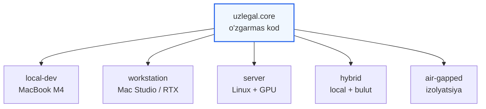
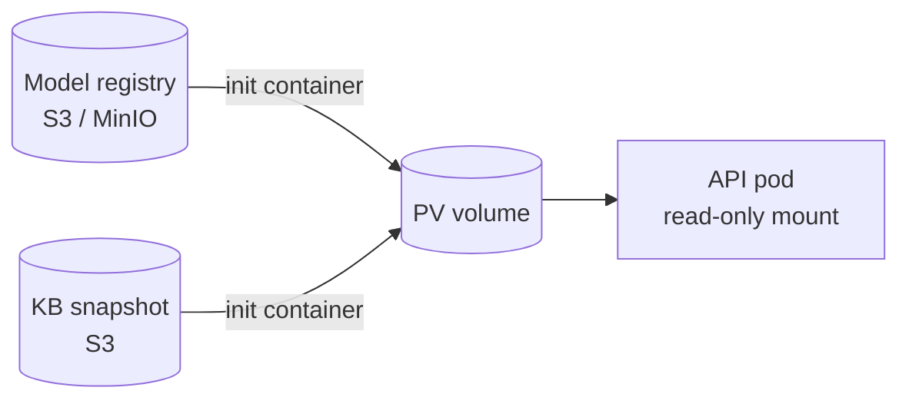
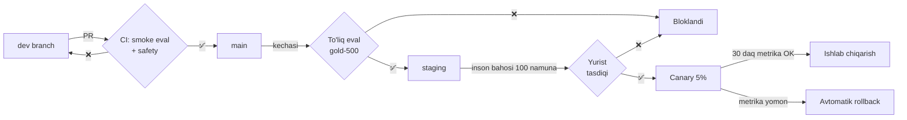

# 09 — Joylashtirish

> Talab: tizim turli sharoitlarda ishlashi kerak. Bu hujjat beshta joylashtirish profilini va ular orasida o'tish yo'lini tavsiflaydi.

## 1. Profil tushunchasi

Kod barcha muhitda **bir xil**. Farq faqat `configs/profiles/*.yaml` da:



## 2. Profillar

| Profil | Apparat | Model | Runtime | Vektor DB | Debate | Foydalanuvchi |
|--------|---------|-------|---------|-----------|--------|---------------|
| `local-dev` | M4 24 GB | 14B 4-bit | MLX | LanceDB | ~30 s | 1 |
| `workstation` | M4 Max 64 GB / RTX 4090 | 32B 4-bit | MLX / vLLM | LanceDB | ~18 s | 1–5 |
| `server` | Linux + A100 80 GB | 32B fp16 | vLLM | Qdrant | ~6 s | 50+ |
| `hybrid` | Local + bulut API | Aralash | MLX + API | LanceDB | ~10 s | 1–10 |
| `air-gapped` | Izolyatsiya qilingan | 14B 4-bit | MLX/llama.cpp | LanceDB | ~30 s | 1–20 |

### `local-dev` — ishlab chiqish va shaxsiy foydalanish

```yaml
# configs/profiles/local-dev.yaml
inference:
  backend: mlx
  model: models/uzlegal-14b-4bit
  adapters_dir: adapters/
  max_context: 8192
  kv_cache_prefix: true          # debate uchun kritik

retrieval:
  vector_store: lancedb
  path: ./kb/current/vectors
  lexical: tantivy
  reranker: bge-reranker-v2-m3
  top_k_retrieve: 50
  top_k_rerank: 8

orchestration:
  parallel_agents: false          # bitta model — ketma-ket
  max_debate_rounds: 2
  timeout_per_agent_s: 60

api:
  host: 127.0.0.1                 # faqat local
  port: 8080
  auth: none
```

Ishga tushirish:

```bash
uzlegal serve --profile local-dev
# → API:  http://127.0.0.1:8080
# → Web:  http://127.0.0.1:3000
```

Butunlay oflayn: internet uzilsa ham ishlaydi (KB local, model local).

### `server` — ishlab chiqarish

```yaml
# configs/profiles/server.yaml
inference:
  backend: vllm
  model: models/uzlegal-32b
  dtype: bfloat16
  tensor_parallel: 1
  enable_lora: true               # ← multi-LoRA, haqiqiy parallel
  max_loras: 5
  max_lora_rank: 16
  gpu_memory_utilization: 0.90

retrieval:
  vector_store: qdrant
  url: http://qdrant:6333
  lexical: elasticsearch
  reranker_service: http://reranker:8001

orchestration:
  parallel_agents: true           # ← vLLM multi-LoRA
  max_debate_rounds: 2

api:
  host: 0.0.0.0
  port: 8080
  auth: api_key
  rate_limit: 60/min
  cors_origins: ["https://app.example.uz"]

observability:
  tracing: otlp
  metrics: prometheus
  logs: json
```

**vLLM multi-LoRA** — server profilining asosiy afzalligi: beshta adapter bir vaqtda faol, agentlar haqiqatan parallel ishlaydi. Bu debate ni 30 s dan 6 s ga tushiradi.

### `hybrid` — tejamkor variant

Yengil ishlar local, og'ir ishlar bulutda:

```yaml
inference:
  routing:
    - match: {mode: simple}
      backend: mlx
      model: models/uzlegal-8b-4bit        # tez, local
    - match: {mode: standard}
      backend: mlx
      model: models/uzlegal-14b-4bit
    - match: {mode: complex}
      backend: remote
      endpoint: https://gpu.example.uz/v1   # o'z serveringiz
      fallback: mlx                          # ulanish yo'q → local
```

**Muhim:** `remote` — o'z serveringiz, uchinchi tomon LLM API si emas. Mijoz ma'lumoti tashqi provayderga chiqmaydi.

### `air-gapped` — izolyatsiya qilingan muhit

Davlat organlari yoki maxfiy ish ma'lumoti uchun.

Talablar:
- Hech qanday tashqi tarmoq chaqiruvi yo'q (kodda ham tekshiriladi)
- Model, KB, barcha bog'liqliklar oflayn o'rnatiladi
- Yangilanish faqat fizik ko'chirish orqali (imzolangan paket)
- Barcha so'rovlar audit log ga yoziladi

```bash
# Bir mashinada paket tayyorlash
uzlegal package build --profile air-gapped --out uzlegal-offline-v0.2.tar.gz
# → model + KB + wheels + web build, hammasi ichida (~25 GB)

# Izolyatsiya qilingan mashinada
uzlegal package verify uzlegal-offline-v0.2.tar.gz --signature ...
uzlegal package install uzlegal-offline-v0.2.tar.gz
uzlegal serve --profile air-gapped --no-network
```

`--no-network` bayrog'i runtime da tashqi socket ochilishini bloklaydi.

## 3. Docker

```
docker/
├── Dockerfile.api          # FastAPI + core (CPU/GPU)
├── Dockerfile.web          # Next.js
├── Dockerfile.worker       # Batch/ingest ishchisi
├── docker-compose.local.yml
└── docker-compose.server.yml
```

```yaml
# docker-compose.server.yml (qisqartirilgan)
services:
  api:
    build: {context: ., dockerfile: docker/Dockerfile.api}
    environment:
      UZLEGAL_PROFILE: server
    deploy:
      resources:
        reservations:
          devices: [{driver: nvidia, count: 1, capabilities: [gpu]}]
    volumes: ["./models:/models:ro", "./kb:/kb:ro"]
    depends_on: [qdrant, postgres]

  web:
    build: {context: ., dockerfile: docker/Dockerfile.web}
    environment: {NEXT_PUBLIC_API_URL: http://api:8080}
    ports: ["3000:3000"]

  qdrant:
    image: qdrant/qdrant:latest
    volumes: ["qdrant_data:/qdrant/storage"]

  postgres:
    image: postgres:17
    volumes: ["pg_data:/var/lib/postgresql/data"]

  worker:
    build: {context: ., dockerfile: docker/Dockerfile.worker}
    command: uzlegal worker --queue ingest

volumes: {qdrant_data: {}, pg_data: {}}
```

> Apple Silicon eslatmasi: Docker ichida **Metal ishlamaydi**. `local-dev` profilida MLX **native** ishga tushiriladi, Dockerda emas. Docker faqat yordamchi servislar (Postgres) yoki Linux/GPU serverlari uchun.

## 4. Kubernetes (server-scale)

```
k8s/
├── api-deployment.yaml       # HPA: CPU + so'rovlar navbati bo'yicha
├── web-deployment.yaml
├── worker-cronjob.yaml       # kunlik ingest sync
├── qdrant-statefulset.yaml
├── configmap-profiles.yaml
└── secrets.yaml              # sealed-secrets
```

Masshtablash mantiqi:

| Komponent | Masshtablash | Chegara |
|-----------|--------------|---------|
| API (GPU) | Vertikal, keyin gorizontal | GPU narxi |
| Web | Gorizontal, arzon | — |
| Worker | Navbat uzunligi bo'yicha | — |
| Qdrant | StatefulSet, replikatsiya | Disk |

GPU podlari qimmat — shuning uchun **so'rovlar navbati** (queue) ishlatiladi: burst yuklamada so'rov navbatga tushadi, yangi GPU pod ko'tarilmaydi.

## 5. Model va KB yetkazib berish

Model fayllari (8–35 GB) Docker image ichiga **qo'yilmaydi**:



Yangilanish tartibi:

```bash
uzlegal release publish --model v0.3 --kb v2026.10.01
# 1. Yangi versiya S3 ga yuklanadi
# 2. Canary pod (5% trafik) ko'tariladi
# 3. Avtomatik smoke eval
# 4. Metrikalar 30 daqiqa kuzatiladi
# 5. OK bo'lsa → to'liq rollout; yomon bo'lsa → avtomatik rollback
```

**KB va model versiyalari mustaqil.** Qonun o'zgarganda faqat KB yangilanadi (model qayta o'qitilmaydi) — bu [T1 tamoyili](01-architecture.md#1-dizayn-tamoyillari) ning amaliy foydasi va operatsion tejamkorlik manbai.

## 6. Kuzatuv (observability)

### Metrikalar (Prometheus)

```
uzlegal_consult_total{mode, status}
uzlegal_consult_duration_seconds{mode, quantile}
uzlegal_agent_duration_seconds{role}
uzlegal_retrieval_score{quantile}
uzlegal_gate_claims_dropped_total
uzlegal_refusal_total{reason}
uzlegal_model_load_seconds
uzlegal_adapter_swap_seconds
uzlegal_gpu_memory_bytes
uzlegal_kb_version_info{version}
```

### Ogohlantirishlar

| Ogohlantirish | Shart | Jiddiylik |
|---------------|-------|-----------|
| Yuqori rad etish | `refusal_rate > 0.2` 15 daq | ⚠️ Warning |
| Gate ko'p o'chirmoqda | `dropped/claims > 0.15` | ⚠️ Warning |
| Latency degradatsiyasi | `p95 > 1.5 × SLO` | ⚠️ Warning |
| Model yuklanmadi | `model_ready == 0` | 🔴 Critical |
| **Deprecated norma chiqdi** | `deprecated_leak > 0` | 🔴 **Critical** |
| KB eskirgan | `kb_age_days > 14` | ⚠️ Warning |

Oxirgi ikkitasi yuridik tizimga xos — boshqa mahsulotlarda bunday ogohlantirish bo'lmaydi.

### Tracing

OpenTelemetry, har bir `consult()` bir trace:

```
consult (56.8s)
├── route (0.1s)
├── retrieve (0.48s)
│   ├── expand_query (0.05s)
│   ├── vector_search (0.18s)
│   ├── bm25_search (0.09s)
│   ├── rrf_fuse (0.01s)
│   ├── version_filter (0.01s)
│   └── rerank (0.14s)
├── jurist (7.2s)
├── debate_r1 (15.4s)
│   ├── advocate (7.6s)
│   └── prosecutor (7.8s)
├── debate_r2 (14.9s)
├── professor (8.1s)
├── judge (9.6s)
└── gate (1.2s)
```

## 7. Zaxira va tiklash

| Aktiv | Zaxira | RPO | RTO |
|-------|--------|-----|-----|
| Xom hujjatlar | S3 versiyalash | 24 s | 1 soat |
| KB snapshot | Kunlik, 30 kun saqlanadi | 24 s | 30 daq |
| Adapter fayllari | Git LFS + S3 | 0 | 15 daq |
| Trace/audit log | Kunlik, **7 yil** saqlanadi | 1 soat | 4 soat |
| Gold set | Git | 0 | 5 daq |

Audit log 7 yil — yuridik hujjatlar uchun odatiy saqlash muddati. Bu [`docs/10-security-compliance.md`](10-security-compliance.md) da asoslanadi.

## 8. Xarajat baholari

| Profil | Oylik | Tarkibi |
|--------|-------|---------|
| `local-dev` | **$0** | Mavjud apparat |
| `workstation` | ~$0 | Bir martalik apparat xarajati |
| `server` (A100, 24/7) | ~$1 100 | GPU $900 + saqlash $80 + tarmoq $120 |
| `server` (spot/burst) | ~$350 | Faqat yuklama vaqtida |
| `hybrid` | ~$120 | Local + kichik bulut GPU |
| Trening (bir martalik) | ~$12–50 | A100 ijara, 5 adapter |

Boshlash tavsiyasi: `local-dev` → foydalanuvchilar paydo bo'lgach `hybrid` → yuklama o'sgach `server`.

## 9. Reliz jarayoni



**Yurist tasdiqi majburiy bosqich.** Yuridik mahsulotda faqat avtomatik testlar yetarli emas — har reliz oldidan malakali mutaxassis namunani ko'radi.

## 10. Keyingi hujjat

→ [10 — Xavfsizlik va muvofiqlik](10-security-compliance.md)
