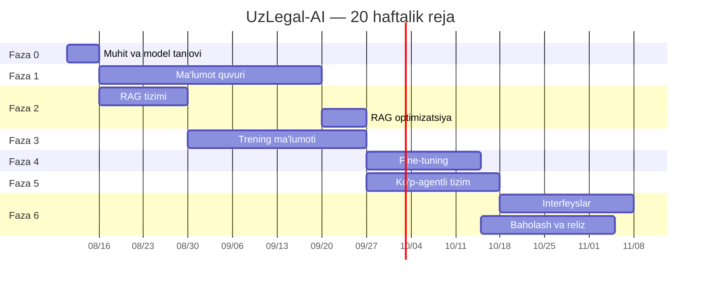

# 11 — Yo'l xaritasi

## 1. Umumiy jadval



Faza 2 Faza 1 bilan **parallel** boshlanadi (kichik test korpusida), bu 3 hafta tejaydi.

---

## 2. Faza 0 — Muhit va model tanlovi

**Muddat:** 5 kun | **Ustuvorlik:** P0 | **Bog'liqlik:** yo'q

| # | Vazifa | Natija |
|---|--------|--------|
| 0.1 | Python 3.11, MLX, RAG stek o'rnatish | Ishlaydigan muhit |
| 0.2 | GPU wired limit sozlash, benchmark | Baseline tok/s |
| 0.3 | Repo skeleti, CI, pre-commit | Kod bazasi |
| 0.4 | `bench-uz-legal-v0` — 100 savol tuzish | Baholash to'plami |
| 0.5 | 3 nomzod modelni yuklab baholash | Solishtirish hisoboti |
| 0.6 | Baza modelni tanlash | **ADR-001 yozilgan** |
| 0.7 | KV-cache prefiks prototipi | Tezlik o'lchovi |

**Chiqish mezoni:** baza model tanlangan va asoslangan; `uzlegal doctor` yashil.

---

## 3. Faza 1 — Ma'lumot quvuri

**Muddat:** 5 hafta | **Ustuvorlik:** P0 | **Eng katta risk**

| # | Vazifa | Muddat | Natija |
|---|--------|--------|--------|
| 1.1 | lex.uz konnektori + fetch | 1 hafta | Xom arxiv |
| 1.2 | HTML parser (ierarxiya saqlovchi) | 1.5 hafta | Strukturalangan hujjatlar |
| 1.3 | Normalizatsiya (apostrof, kirill, sana) | 3 kun | Toza matn |
| 1.4 | Versiyalash mexanizmi | 1.5 hafta | Versiya jadvali |
| 1.5 | Havola grafi qurish | 3 kun | Graf |
| 1.6 | PII anonimizatsiya (sud qarorlari) | 3 kun | Toza sud korpusi |
| 1.7 | Chunking + metadata | 3 kun | ~250k chunk |
| 1.8 | Validatsiya + qo'lda namuna tekshiruvi | 3 kun | Sifat hisoboti |

**Chiqish mezoni:**
- ≥ 35 000 hujjat qamrab olingan
- Versiya to'g'riligi ≥ 98% (200 modda namunasida)
- Qo'lda tekshiruvda xato ≤ 2%
- Karantin ≤ 5%

---

## 4. Faza 2 — RAG tizimi

**Muddat:** 2 + 1 hafta | **Ustuvorlik:** P0 | **Faza 1 bilan parallel**

| # | Vazifa | Natija |
|---|--------|--------|
| 2.1 | BGE-M3 embedding quvuri | Vektor indeks |
| 2.2 | BM25 leksik indeks (o'zbek tokenizatsiyasi) | Leksik indeks |
| 2.3 | RRF gibrid birlashtirish | Gibrid qidiruv |
| 2.4 | Versiya filtri | Deprecated leak = 0 |
| 2.5 | Reranker integratsiyasi | nDCG o'sishi |
| 2.6 | Graf kengaytmasi | Boyitilgan kontekst |
| 2.7 | `retrieval-gold-v1` (500 juftlik) | Baholash to'plami |
| 2.8 | Optimizatsiya (Faza 1 tugagach, to'liq korpusda) | Maqsad metrikalar |

**Chiqish mezoni:** Recall@10 ≥ 90%, deprecated leak = 0%, p95 ≤ 600 ms.

> Bu bosqich tugagach tizim **allaqachon foydali** — fine-tuningsiz, RAG + baza model bilan ~70% aniqlik. Bu birinchi demo nuqtasi.

---

## 5. Faza 3 — Trening ma'lumoti

**Muddat:** 4 hafta | **Ustuvorlik:** P1 | **Blokerli bog'liqlik: yurist ekspert**

| # | Vazifa | Natija |
|---|--------|--------|
| 3.1 | Urug' savollarni ajratish | 5k urug' |
| 3.2 | Sintetik generatsiya quvuri | Nomzodlar hovuzi |
| 3.3 | Avtomatik filtrlar | Tozalangan hovuz |
| 3.4 | Yurist tekshiruv interfeysi | Tekshirish vositasi |
| 3.5 | v0.1 dataset (2k namuna) | Trening ma'lumoti |
| 3.6 | Gold set v1 (500 savol) | Baholash to'plami |

**Chiqish mezoni:** 2 000 tekshirilgan namuna (400/rol) + 500 gold savol.

**Kritik risk:** yurist vaqti. Agar ekspert topilmasa — bu faza to'xtaydi va butun loyiha sifati cheklanadi. Yumshatish: ekspertni Faza 1 da jalb qilish, ish hajmini bosqichga bo'lish, tekshirish interfeysini maksimal qulay qilish (30 s/namuna maqsad).

---

## 6. Faza 4 — Fine-tuning

**Muddat:** 2.5 hafta | **Ustuvorlik:** P1

| # | Vazifa | Natija |
|---|--------|--------|
| 4.1 | CPT qarori (kerakmi?) | Qaror + ADR |
| 4.2 | Umumiy SFT trening | `uzlegal-base-sft` |
| 4.3 | 5 rol LoRA trening | 5 adapter |
| 4.4 | Har adapter baholash | Metrikalar |
| 4.5 | Adapter reestri va versiyalash | Reestr |
| 4.6 | Merge + kvantlash + GGUF eksport | Reliz artefaktlari |

**Chiqish mezoni:** har adapterda rol sodiqligi ≥ 90%, format rioyasi ≥ 98%, umumiy qobiliyat regressiyasi ≤ 5%.

---

## 7. Faza 5 — Ko'p-agentli tizim

**Muddat:** 3 hafta | **Ustuvorlik:** P0

| # | Vazifa | Natija |
|---|--------|--------|
| 5.1 | LangGraph grafi | Orkestrator |
| 5.2 | Router (murakkablik klassifikatori) | Rejim tanlash |
| 5.3 | Debate protokoli + kelishmovchilik balli | Munozara |
| 5.4 | Judge sintezi | Xulosa |
| 5.5 | **Groundedness gate** | Iqtibos nazorati |
| 5.6 | Adapter pool + prefix KV-cache | Tezlik |
| 5.7 | Trace va checkpointing | Kuzatiluvchanlik |
| 5.8 | Xatolarga chidamlilik | Barqarorlik |

**Chiqish mezoni:** to'liq debate p95 ≤ 45 s; ko'p-agent nizoli savollarda bitta agentdan ≥ 15% yaxshi; gate hallucination ni ≤ 1% ga tushiradi.

---

## 8. Faza 6 — Interfeyslar, baholash, reliz

**Muddat:** 3 hafta | **Ustuvorlik:** P0/P1

| # | Vazifa | Ustuvorlik |
|---|--------|-----------|
| 6.1 | CLI (to'liq) | P0 |
| 6.2 | REST API + SSE | P0 |
| 6.3 | Web UI (maslahat, manbalar, trace) | P0 |
| 6.4 | Python SDK | P1 |
| 6.5 | MCP server | P1 |
| 6.6 | Telegram bot | P1 |
| 6.7 | TypeScript SDK | P2 |
| 6.8 | To'liq gold-500 baholash | P0 |
| 6.9 | Inson bahosi (100 namuna, 2 yurist) | P0 |
| 6.10 | Xavfsizlik auditi | P0 |
| 6.11 | **Huquqiy masalalarni hal qilish** (§10.8) | **P0 bloker** |
| 6.12 | Hujjatlar, model kartasi | P0 |

**Chiqish mezoni:** barcha bloker metrikalar maqsadda; yurist tasdiqi olingan; huquqiy savollar hal qilingan.

---

## 9. Bosqichli natijalar (milestones)

| Veha | Sana (taxminiy) | Nima ishlaydi |
|------|-----------------|---------------|
| **M0** — Muhit | 3-hafta oxiri | Model ishga tushadi, javob beradi |
| **M1** — RAG demo | 7-hafta | Qonundan iqtibos bilan javob (fine-tuningsiz) |
| **M2** — Ma'lumot tayyor | 10-hafta | To'liq KB, versiyalash ishlaydi |
| **M3** — Agentlar | 13-hafta | Ko'p-agentli munozara ishlaydi |
| **M4** — Fine-tuned | 16-hafta | Rol adapterlari, sifat sakrashi |
| **M5** — Beta | 18-hafta | Barcha interfeyslar, cheklangan foydalanuvchilar |
| **M6** — v1.0 | 20-hafta | Ishlab chiqarish |

**M1 muhim veha:** 7-haftada allaqachon ko'rsatish mumkin bo'lgan foydali mahsulot bo'ladi. Bu investor/rahbariyat/foydalanuvchi feedback uchun eng erta nuqta.

---

## 10. Risklar reestri

| # | Risk | Ehtimol | Ta'sir | Yumshatish | Egasi |
|---|------|:-------:|:------:|------------|-------|
| R1 | Yurist ekspert vaqti yetishmasligi | **Yuqori** | **Kritik** | Erta jalb qilish; bosqichli hajm; qulay interfeys; kichikroq lekin toza dataset | PM |
| R2 | lex.uz parsing kutilganidan murakkab | O'rta | Yuqori | Faza 1 ga zaxira 1 hafta; erta prototip | Data eng. |
| R3 | Versiyalash noto'g'ri ishlaydi | O'rta | **Kritik** | Konsolidatsiyalangan versiya bilan solishtirish; 200 modda qo'lda tekshiruv | Data eng. |
| R4 | Baza model o'zbek tilida zaif | O'rta | Yuqori | Faza 0 da o'lchash; CPT zaxira rejasi | ML eng. |
| R5 | 24 GB RAM yetmasligi | Past | O'rta | Adapter arxitekturasi; 8B fallback; bulut trening | ML eng. |
| R6 | Debate 45 s dan sekin | O'rta | O'rta | Prefix KV-cache; router; raund 2 shartli | ML eng. |
| R7 | Huquqiy javobgarlik noaniqligi | O'rta | **Kritik** | Faza 6 bloker; yurist bilan hal qilish | PM |
| R8 | Hallucination maqsaddan yuqori | Past | **Kritik** | Gate deterministik; tuzoq savollar; reliz bloki | ML eng. |
| R9 | Loyiha bitta odamga bog'liq (bus factor 1) | **Yuqori** | Yuqori | Hujjatlashtirish (bu repo); modullar mustaqil | PM |

**R1 va R9 eng jiddiy** — ikkalasi ham texnik emas, tashkiliy.

---

## 11. Resurs rejasi

### Minimal jamoa

| Rol | Yuklama | Faza |
|-----|---------|------|
| ML muhandis | 100% | 0, 2, 4, 5 |
| Data muhandis | 100% | 1, 3 |
| Yurist ekspert | 40% | 1, 3, 6 |
| Frontend | 50% | 6 |
| PM | 30% | Hammasi |

Bitta odam qilsa: ~40 hafta (2× uzunroq) + yurist ekspert baribir majburiy.

### Byudjet (bir martalik)

| Element | Xarajat |
|---------|---------|
| Bulut GPU (trening) | ~$50 |
| Sintetik data generatsiyasi (API) | ~$300 |
| Yurist ekspert (400 soat) | Bozor stavkasi bo'yicha |
| Baholash (LLM-judge API) | ~$100 |
| Server (agar kerak bo'lsa, oyiga) | ~$350–1100 |
| **Texnik jami** | **~$450 + server** |

Asosiy xarajat GPU emas — **ekspert vaqti**.

---

## 12. Faza 0 dan keyingi birinchi qadamlar

Darhol bajariladigan ish:

```bash
# 1. Muhit
brew install python@3.11
uv venv --python 3.11 && source .venv/bin/activate
uv pip install mlx mlx-lm lancedb sentence-transformers langgraph fastapi typer

# 2. GPU chegarasi
sudo sysctl iogpu.wired_limit_mb=20480

# 3. Nomzod modellar
python -m mlx_lm.convert --hf-path Qwen/Qwen3-14B -q --q-bits 4
python -m mlx_lm.convert --hf-path google/gemma-3-12b-it -q --q-bits 4

# 4. Birinchi baholash
uzlegal models bench --suite bench-uz-legal-v0
```

---

## 13. Kelajak (v1.0 dan keyin)

| Imkoniyat | Ustuvorlik |
|-----------|-----------|
| Yangi rollar: notarius, soliq inspektori, mediator | P1 |
| Hujjat generatsiyasi (shartnoma, ariza loyihasi) | P1 |
| Sud amaliyoti bo'yicha natija bashorati | P2 |
| Qoraqalpoq tili | P2 |
| Ovozli interfeys | P2 |
| Mobil ilova | P2 |
| Qonun loyihalarini tahlil qilish (kolliziya aniqlash) | P3 |
| Xalqaro huquq moduli | P3 |
