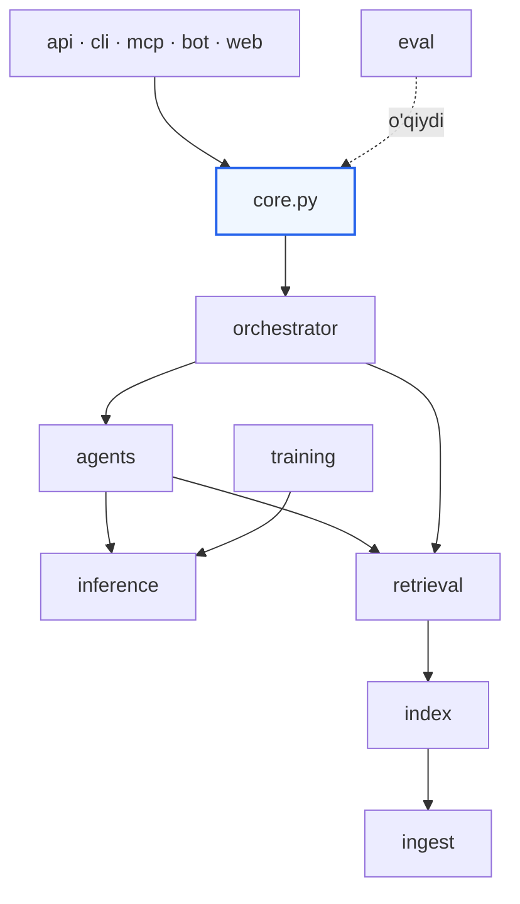

# 12 — Repo strukturasi

## 1. To'liq daraxt

```
uzlegal-ai/
├── README.md
├── LICENSE
├── CONTRIBUTING.md
├── CHANGELOG.md
├── DATA_SOURCES.md              # manbalar, litsenziyalar, olingan sana
├── INCIDENTS.md                 # jiddiy xatolar va choralar
├── Makefile
├── pyproject.toml
│
├── docs/                        # ← hozir shu yerdasiz
│   ├── 00-overview.md … 12-repo-structure.md
│   └── adr/                     # arxitektura qarorlari
│
├── configs/
│   ├── profiles/                # local-dev · workstation · server · hybrid · air-gapped
│   ├── agents/                  # rol konfiguratsiyalari (YAML)
│   ├── training/                # LoRA / SFT / CPT giperparametrlar
│   ├── retrieval/               # qidiruv profillari
│   └── models.yaml              # nomzodlar va reliz modellari
│
├── prompts/
│   ├── system/                  # umumiy tizim promptlari
│   ├── roles/                   # jurist.uz.md · advocate.uz.md · …
│   └── eval/                    # LLM-judge rubrikalari
│
├── schemas/
│   ├── openapi.yaml             # REST API shartnomasi
│   ├── consult.schema.json      # ConsultRequest / ConsultResult
│   ├── chunk.schema.json        # KB chunk metadata
│   └── training-sample.schema.json
│
├── src/uzlegal/
│   ├── __init__.py
│   ├── core.py                  # ← consult() — yagona kirish nuqtasi
│   ├── types.py                 # umumiy Pydantic modellari
│   ├── config.py                # profil yuklash
│   │
│   ├── ingest/                  # 0-qatlam: ma'lumot
│   │   ├── connectors/          # lex_uz.py · sud_uz.py · base.py
│   │   ├── parsers/             # html.py · pdf.py · ocr.py
│   │   ├── normalize.py         # apostrof · kirill · sana
│   │   ├── versioning.py        # tahrirlar, amal qilish muddati
│   │   ├── linking.py           # havola grafi
│   │   ├── redact.py            # PII anonimizatsiya
│   │   └── validate.py          # sifat nazorati
│   │
│   ├── index/                   # 1-qatlam: indekslash
│   │   ├── chunker.py           # tuzilmaga asoslangan chunking
│   │   ├── embedder.py          # BGE-M3
│   │   ├── vector_store.py      # LanceDB / Qdrant adapteri
│   │   ├── lexical.py           # BM25 / Tantivy
│   │   └── graph.py             # hujjat grafi
│   │
│   ├── retrieval/               # 1-qatlam: qidiruv
│   │   ├── query.py             # tahlil, kengaytirish, HyDE
│   │   ├── hybrid.py            # RRF birlashtirish
│   │   ├── version_filter.py    # ← amaldagi normalar
│   │   ├── reranker.py
│   │   └── context.py           # kontekstni yig'ish
│   │
│   ├── inference/               # 2-qatlam: model
│   │   ├── backend.py           # InferenceBackend protokoli
│   │   ├── mlx_backend.py
│   │   ├── vllm_backend.py
│   │   ├── adapter_pool.py      # ← bitta baza, ko'p adapter
│   │   └── kv_cache.py          # prefix cache
│   │
│   ├── agents/                  # 3-qatlam: rollar
│   │   ├── base.py              # Agent protokoli
│   │   ├── jurist.py · advocate.py · prosecutor.py
│   │   ├── professor.py · judge.py
│   │   └── registry.py          # YAML dan yuklash
│   │
│   ├── orchestrator/            # 4-qatlam: oqim
│   │   ├── graph.py             # LangGraph
│   │   ├── router.py            # murakkablik klassifikatori
│   │   ├── debate.py            # raundlar, kelishmovchilik balli
│   │   ├── gate.py              # ← groundedness gate
│   │   └── trace.py
│   │
│   ├── training/
│   │   ├── dataset/             # generate.py · filter.py · review.py
│   │   ├── sft.py · lora.py · cpt.py
│   │   ├── merge.py · export.py # GGUF eksport
│   │   └── registry.py          # adapter reestri
│   │
│   ├── eval/
│   │   ├── suites/              # gold-500 · traps-30 · smoke-50
│   │   ├── retrieval_eval.py
│   │   ├── agent_eval.py
│   │   ├── safety_eval.py
│   │   ├── judge.py             # LLM-judge
│   │   └── compare.py           # A/B
│   │
│   ├── api/                     # 5–6-qatlam: interfeyslar
│   │   ├── app.py · routes/ · sse.py
│   │   ├── auth.py · ratelimit.py · audit.py
│   ├── cli/
│   │   ├── main.py · chat.py · ask.py · admin.py
│   ├── mcp/
│   │   └── server.py
│   └── bot/
│       └── telegram.py
│
├── web/                         # Next.js
│   ├── app/ · components/ · lib/
│
├── data/                        # gitignore (LFS/S3 da)
│   ├── raw/ · processed/ · sft/ · eval/
│
├── kb/                          # gitignore — bilim bazasi snapshotlari
│   ├── v2026.09.01/ · current -> …
│
├── models/                      # gitignore — model fayllari
├── adapters/                    # LoRA adapterlar (LFS)
│   └── registry.yaml
│
├── docker/
├── k8s/
├── scripts/
│   ├── setup_mac.sh · download_models.sh · bootstrap_kb.sh
└── tests/
    ├── unit/ · integration/ · e2e/ · fixtures/
```

## 2. Bog'liqlik qoidalari



Qat'iy qoidalar, CI da tekshiriladi (`import-linter`):

1. **`core` va undan pastdagi hech narsa `api`/`cli`/`mcp`/`bot` ni import qilmaydi**
2. `ingest` hech narsani import qilmaydi (eng past qatlam)
3. `agents` `orchestrator` ni import qilmaydi (yuqoriga bog'liqlik yo'q)
4. `eval` hamma narsani o'qiy oladi, lekin hech kim `eval` ni import qilmaydi
5. Tashqi kutubxonalar faqat adapter modullarda (`mlx_backend`, `vector_store`)

Qoida 5 muhim: MLX dan vLLM ga o'tish faqat bitta faylni o'zgartiradi.

## 3. Asosiy interfeyslar (protokollar)

Bu protokollar modullarni almashtiriladigan qiladi:

```python
# inference/backend.py
class InferenceBackend(Protocol):
    def load(self, model_path: str) -> None: ...
    def set_adapter(self, adapter: str | None) -> None: ...
    def generate(self, prompt: str, *, max_tokens: int,
                 temperature: float, prefix_cache: Any = None) -> str: ...
    def stream(self, prompt: str, **kw) -> Iterator[str]: ...
    def make_cache(self, prefix: str) -> Any: ...

# index/vector_store.py
class VectorStore(Protocol):
    def upsert(self, chunks: list[Chunk], vectors: NDArray) -> None: ...
    def search(self, vector: NDArray, k: int,
               filters: dict | None = None) -> list[ScoredChunk]: ...

# ingest/connectors/base.py
class SourceConnector(Protocol):
    name: str
    def discover(self, since: date | None) -> Iterator[DocumentRef]: ...
    def fetch(self, ref: DocumentRef) -> RawDocument: ...

# agents/base.py
class Agent(Protocol):
    role: str
    def run(self, frame: LegalFrame, ctx: AgentContext) -> BaseModel: ...
```

Har bir protokol uchun kamida ikkita amalga oshirish bo'lishi rejalashtirilgan (masalan `MLXBackend` va `VLLMBackend`) — bu abstraksiya haqiqatan ishlashini isbotlaydi.

## 4. Konfiguratsiya iyerarxiyasi

```
1. Kod ichidagi standart qiymatlar
2. configs/profiles/<profile>.yaml
3. configs/local.yaml           (gitignore — shaxsiy sozlamalar)
4. Environment o'zgaruvchilari  (UZLEGAL_*)
5. CLI argumentlari             (eng yuqori ustunlik)
```

```bash
UZLEGAL_PROFILE=server \
UZLEGAL_INFERENCE__MODEL=models/uzlegal-32b \
uzlegal serve --port 9000
```

Ikki pastki chiziq (`__`) ichma-ich maydonni bildiradi (`pydantic-settings` konvensiyasi).

## 5. Testlash strategiyasi

| Daraja | Nima | Tezlik | Qachon |
|--------|------|--------|--------|
| `unit/` | Sof funksiyalar: normalizatsiya, chunking, RRF, versiya filtri | < 10 s | Har commit |
| `integration/` | Retrieval quvuri, adapter pool, gate | ~2 daq | Har PR |
| `e2e/` | To'liq `consult()`, kichik test KB | ~10 daq | Har PR |
| `eval/` | Sifat metrikalari (test emas, o'lchov) | 5 daq – 2 soat | PR / kechasi |

**Muhim ajratish:** `tests/` — kod to'g'ri ishlaydimi (deterministik, ✅/❌). `eval/` — model yaxshi javob beradimi (statistik, ball). Ularni aralashtirmaslik kerak.

Test uchun kichik KB fixture (`tests/fixtures/mini-kb/`) — 50 ta hujjat, versiyalar bilan. Bu e2e testlarni tez va determinstik qiladi.

## 6. Kod standartlari

| Vosita | Maqsad |
|--------|--------|
| `ruff` | Lint + format |
| `mypy --strict` | Turlar (`src/uzlegal/` uchun majburiy) |
| `import-linter` | Qatlam bog'liqliklari |
| `pytest` + `pytest-cov` | Testlar, qamrov ≥ 75% |
| `pre-commit` | Commit oldidan hammasi |

Konvensiyalar:
- Barcha ommaviy funksiyalar type-hinted
- Ma'lumot strukturalari — Pydantic modellari (validatsiya bepul)
- Yon ta'sirsiz funksiyalar afzal (test qilish oson)
- Docstring: nima uchun, nima emas (kod nimani qilayotganini o'zi aytadi)
- Izohlar o'zbek yoki ingliz tilida — bir faylda izchil

## 7. Makefile

```makefile
setup-mac:      ## Apple Silicon muhitini o'rnatish
lint:           ## ruff + mypy + import-linter
test:           ## unit + integration
test-e2e:       ## to'liq e2e (mini-kb bilan)
eval-smoke:     ## tez sifat tekshiruvi (50 savol)
eval-full:      ## to'liq gold-500
serve:          ## API + web (local-dev)
ingest:         ## KB ni noldan qurish
train ROLE=…:   ## rol adapterini o'qitish
bench:          ## model nomzodlarini solishtirish
doctor:         ## muhit diagnostikasi
```

## 8. Branch va reliz

| Branch | Maqsad |
|--------|--------|
| `main` | Barqaror, har doim yashil |
| `dev` | Integratsiya |
| `feat/*` | Xususiyat |
| `data/*` | KB yangilanishi (alohida — kod emas) |

Versiyalash: `MAJOR.MINOR.PATCH`, va **model/KB versiyalari mustaqil**:

```
uzlegal 0.2.1  ·  model uzlegal-14b-v0.2  ·  kb v2026.09.01
```

Uchtasi ham har javobda va audit logda ko'rsatiladi — nosozlikni takrorlash uchun bu uchlik yetarli.
